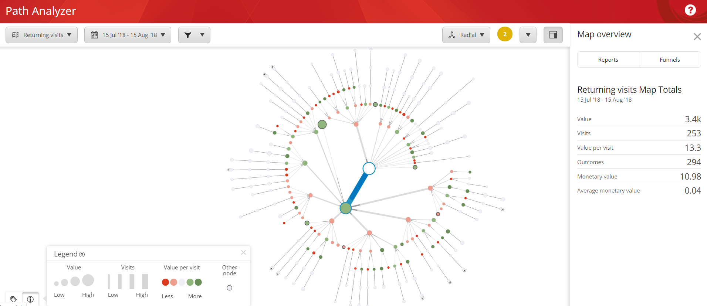
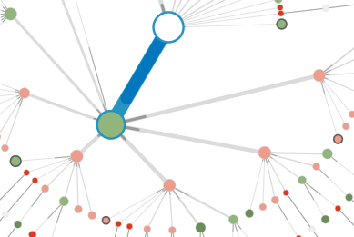
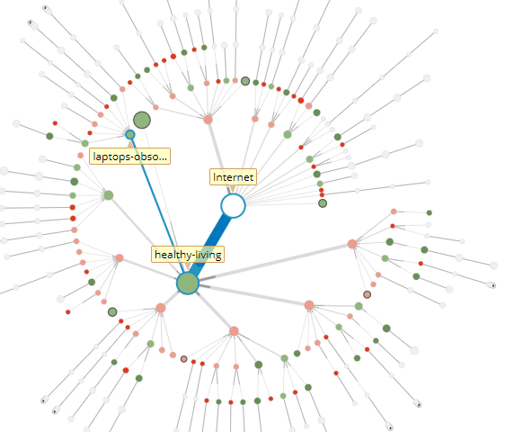
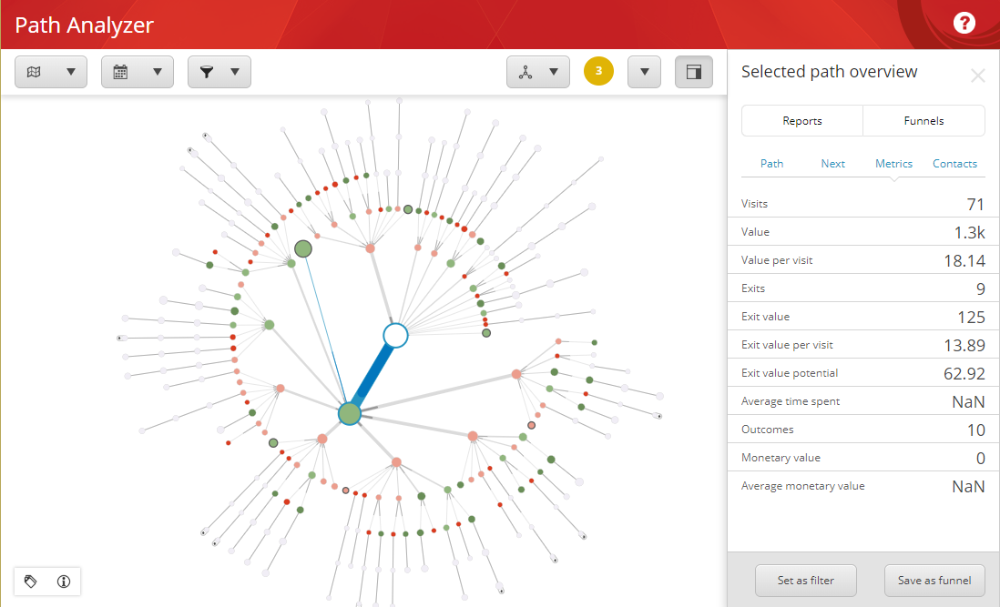

######################################################
Path アナライザーのマップ
######################################################

パスアナライザーのマップは、コンタクトがウェブサイトを通過する際のパスを視覚的に表現したものです。マップは、3 つの基本的な要素で構成されています。

* ノード
* パス
* ツリー

ノードは、ページ、目標、または他のマーケティング活動を表すことができます。各ノードは、マップ上では円として描かれています。

パスは、コンタクトが特定のチャネルやキャンペーンから特定の目標やイベントに至るまでの過程で、コンタクトが相互作用した ノードのシーケンスで構成されています。マップにパスを含めるには、2 つ以上のコンタクトが同じ相互作用のシーケンスを持っていなければなりません。

ツリーは Path Analyzer マップの基本構造です。ツリーは、マップの中心ノードから放射状に広がる多数のパスまたは枝から構成されます。この中心ノードは、ツリー ノードとも呼ばれます。

マップを表示するときは、以下の表示モードを切り替えることができます。半径方向、垂直方向、水平方向、表、ダッシュボード。

次のスクリーンショットは、放射状モードのマップを示しています。

******************
マップの凡例
******************

ノードには、ノードに関する情報を提供する2つの視覚的なプロパティがあります：サイズと色です。

ノードのサイズは、そのノードとその子孫のすべてのエンゲージメントの合計値を示します。言い換えれば、ノードが大きいほど、総エンゲージメント値が大きいことを表します。

円の色は、ノードの親の1回の訪問あたりの値と比較して、ノードの1回の訪問あたりの値を示しており、パスをさらに下に見たときに、このメトリックの変化を発見するのに役立ちます。円の色が赤の場合、このノードでは1回の訪問あたりの値が減少しています。円の色が親よりも緑が多い場合、このノードでは1回の訪問あたりの値が増加しています。円の色は、兄弟ノード間の訪問当たりの値メトリックを比較して、あるノードからの訪問当たりの値が最も高いパスがどこに続いているかを判断するのにも役立ちます。

太い濃い灰色の境界線を持つ円は、重要度の低いノードの集合体を表します。このタイプのノードは、他のノードとラベル付けされています。

ノードAとノードBの間の接続線の太さは、ノードAからノードBに移動するトラフィックの量を、ノードBの兄弟ノードと比較して示しています。これは、線の太さの違いがわかりにくい場合に情報の視認性を高めるためです。

このようにトラフィックとエンゲージメントの価値を可視化することで、どこに力を入れるべきかを判断することができます。例えば、多くのトラフィックを受信しているがエンゲージメント値があまり発生していないノードは、より詳細な検討と最適化の候補となります。

******************
パスと効率
******************

パス アナライザーのマップを使用して、ウェブサイトの効率を測定することができます。マップ上では、マップに沿ってノードが表示され、特定のページの相対的なエンゲージメント値が表示されます。ノードの色は、濃い赤から濃い緑まであります。パスに沿ったノードが緑色であるほど、エンゲージメント値の生成効率が高くなります。赤色のノードを含むパスは、そのページのエンゲージメント価値が低いことを示しており、最適化の候補になる可能性があります。

パスの効率性を理解するもう一つの鍵は、ノードサイズです。ノードのサイズは、ノードを通過するコンタクトによって生成されるエンゲージメント値が大きくなるほど大きくなります。例えば、暗赤色のノードを持つトラフィックの多いパスを持つパスアナライザのマップを見ることができます。これは、そのパスが多くのコンタクト トラフィックを受けているが、エンゲージメント値レベルが低いことを示しています。従業員の経歴など、特定のタイプのページを含む他のパスは、使用頻度の高いパスよりも高いコンバージョン率につながることがわかります。

ウェブサイトで何が有効かを調べ、最も効率的なパスに訪問者を誘導することで、より多くのエンゲージメント価値を生み出す可能性が高まります。これにより、ウェブサイトとマーケティング戦略をより効率的なものにすることができます。

***********************
メトリクスとレポート
***********************

Path Analyzer マップの右側のペインでは、分析の詳細を表示できます。レポート] タブで、さまざまなタイプの Path Analyzer レポートを表示できます。

[Metrics]パネルには、次のカテゴリが含まれています。

+-----------------------+-----------------------------------------------------------------------------------------------------+
| アイテム              | 説明                                                                                                |
+-----------------------+-----------------------------------------------------------------------------------------------------+
| 訪問数                | この Path の訪問回数。                                                                              |
+-----------------------+-----------------------------------------------------------------------------------------------------+
| バリュー              | この Path を訪れたコンタクトが蓄積したエンゲージメントバリューポイントの合計。                      |
+-----------------------+-----------------------------------------------------------------------------------------------------+
| バリュー / 訪問数     | この Path への1回の訪問あたりの平均的なエンゲージメントバリューポイント。                           |
+-----------------------+-----------------------------------------------------------------------------------------------------+
| 離脱                  | このノードでウェブサイトを去った訪問者の数。                                                        |
+-----------------------+-----------------------------------------------------------------------------------------------------+
| 離脱バリュー          | このノードを終了する前にコンタクトが獲得したエンゲージメント値ポイントの合計。                      |
+-----------------------+-----------------------------------------------------------------------------------------------------+
| 1回の訪問ごとの終了値 | このノードでウェブサイトから退出したコンタクトの1回の訪問あたりの平均エンゲージメント価値ポイント。 |
+-----------------------+-----------------------------------------------------------------------------------------------------+
| 離脱の可能性          | パスが最適化によって得られる可能性のあるエンゲージメント値。                                        |
|                       | 計算は以下のようになります。出口価値潜在値 = (1 回あたりの訪問価値 - 1 回あたりの出口価値) * 出口数 |
+-----------------------+-----------------------------------------------------------------------------------------------------+
| 平均滞在時間 (sec)    | コンタクトがノードに費やした平均時間。                                                              |
+-----------------------+-----------------------------------------------------------------------------------------------------+
| 成果                  | 子孫ノードからの結果も含めて、このパスで実現した結果の数。                                          |
+-----------------------+-----------------------------------------------------------------------------------------------------+
| 貨幣価値              | この Path で得た金銭的価値の合計。                                                                  |
+-----------------------+-----------------------------------------------------------------------------------------------------+
| 平均貨幣価値          | この Path で得られる平均的な貨幣価値。                                                              |
+-----------------------+-----------------------------------------------------------------------------------------------------+

このような場合は、「Metric」パネルには、インターネット ルート ノードに関する情報が表示されます。新しいノードを選択するには、ノードの上にカーソルを置くか、クリックします。これにより、ノードとノードに至るまでのパスの両方について、訪問数や値などの分析情報が表示されます。

.. tip:: 英語版 https://doc.sitecore.com/users/93/sitecore-experience-platform/en/path-analyzer-maps.html

.. toctree::
   :hidden:
   :maxdepth: 1

   path-analyzer-map-types
   create-and-configure-a-new-path-analyzer-map