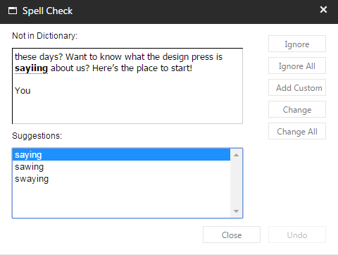
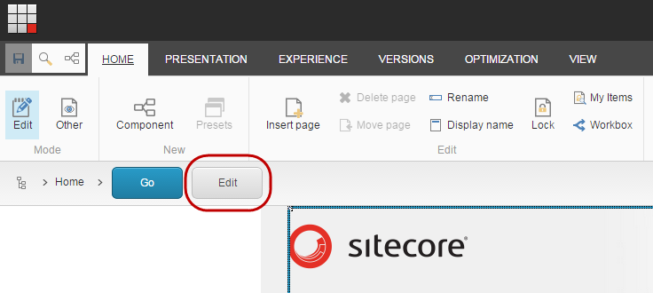

#######################################
アイテムのスペルチェックを行う
#######################################

アイテムのスペルをチェックするには、内蔵のスペルチェッカーを実行することができます。これはアイテムのすべてのテキストフィールドを実行します。

.. note:: スペルチェッカーは現在の項目のみをチェックします。複数の項目を編集している場合は、個別に開いてスペルチェッカーを実行する必要があります。

スペルチェックを実行するには

1. [コンテンツ エディタ] のコンテンツ ツリーで、スペル チェックを実行する項目をクリックします。

2. リボンで、[レビュー] タブをクリックし、[校正] グループで [スペル] をクリックします。

3. [スペル チェック] ダイアログ ボックスで、変更のためのすべての提案を確認します。ダイアログの右側にあるアクション ボタンを使用して、提案を無視したり、実装したりします。

エクスペリエンスエディタからアイテムのスペルチェックを実行するには、まずコンテンツエディタでアイテムを開く必要があります。

* エクスペリエンスエディタのナビゲーションバーで編集をクリックしてから、上記の手順でスペルチェックを実行します。

.. note:: ナビゲーションバーが表示されない場合は、[表示] タブをクリックし、[ナビゲーションバー] チェックボックスを選択します。

.. tip:: 英語版 https://doc.sitecore.com/users/93/sitecore-experience-platform/en/run-a-spell-check-on-an-item.html
