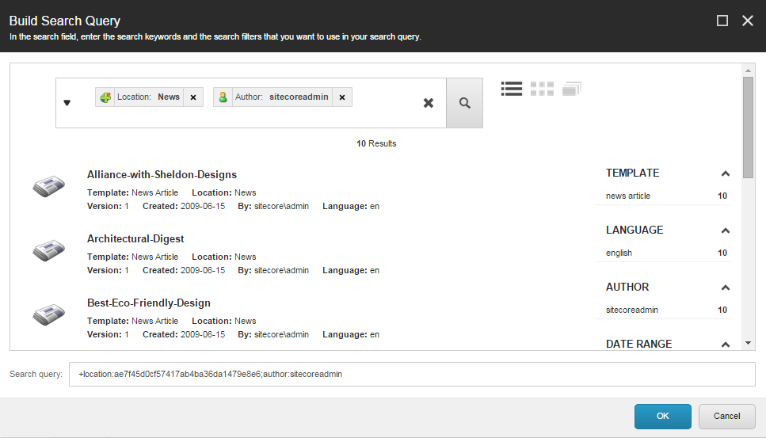

#######################################
アイテムバケットの検索クエリを保存する
#######################################

アイテムバケットを使用していると、同じアイテムバケットから定期的に同じ検索クエリを実行することがあります。コンテンツ エディターでは、アイテムバケットに検索を保存することができ、アイテムバケットをクリックするたびに、保存された検索クエリが自動的に実行されます。

.. note:: アイテムバケットに保存した検索クエリは、あなた自身のSitecoreアカウントに固有のものです。ただし、Sitecore管理者は、保存された検索をすべて設定し、特定のユーザーに利用できるようにするか、すべてのユーザーに利用できるようにするかを決定する必要があります。

アイテム バケットに検索クエリを保存するには

1. コンテンツ ツリーで、検索を保存するアイテム バケットに移動します。
2. [ホーム] タブの [挿入] グループで [保存された検索] をクリックします。または、アイテム バケットを右クリックして、[挿入] をクリックし、[検索を保存] をクリックすることもできます。
3. [メッセージ］ダイアログボックスで、保存した検索に適した名前を入力し、［OK］をクリックします。保存された検索項目は、項目バケットのサブ項目としてコンテンツ ツリーに追加されます。
4. コンテンツ ツリーで、保存された検索アイテムをクリックし、[コンテンツ] タブで [アイテム バケット] セクションまでスクロールします。

.. note:: アイテム バケット セクションが表示されていない場合は、リボンの [表示] タブをクリックし、[表示] グループで [標準フィールド] チェックボックスを選択します。

5. 構築するクエリの上で、クエリの構築 をクリックします。
   次のいずれかをビルドできます。

  * 既定のバケット クエリ - 検索タブを開くたびに検索フィールドに表示されるクエリ。必要に応じて、検索フィールドからクエリを削除することができます。デフォルトのクエリは text:* で、結果としてすべてを返します。
  * Persistent Bucket Filter - 検索フィールドを開くたびに表示され、削除できないクエリ。デフォルトのクエリは、検索を実行する場所を示す location:{親アイテムのID}と、保存された検索テンプレートのIDを示す -template:{保存された検索テンプレートのID}で構成され、保存された検索テンプレートに基づくアイテムを表示しないようにします。

6. [検索クエリの構築］ダイアログボックスの［検索］フィールドで、関連するフィルタと検索キーワードを追加して検索クエリを構築し、［OK］をクリックします。たとえば、以下のスクリーンショットの検索クエリは、場所と著者の永続的なバケット フィルタで構成されていますが、必要な数だけフィルタを入力することができます。

7. 既定のバケット クエリまたは永続バケット フィルタ フィールドからクエリを削除するには、クリアするクエリ フィールドの上で [クリア] をクリックします。

.. image:: images/15eafd357229d8.png
   :align: center
   :width: 400px
   :alt: アイテムバケットの検索クエリを保存する

8. 変更を保存します。

これで、コンテンツツリーのアイテムバケットをクリックすると、自動的に検索が実行されるようになりました。

.. tip:: 英語版 https://doc.sitecore.com/users/93/sitecore-experience-platform/en/save-a-search-query-for-an-item-bucket.html
