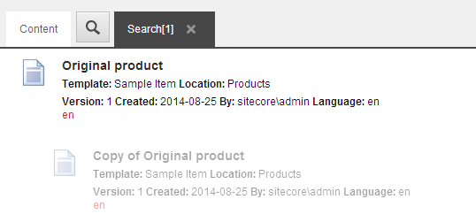
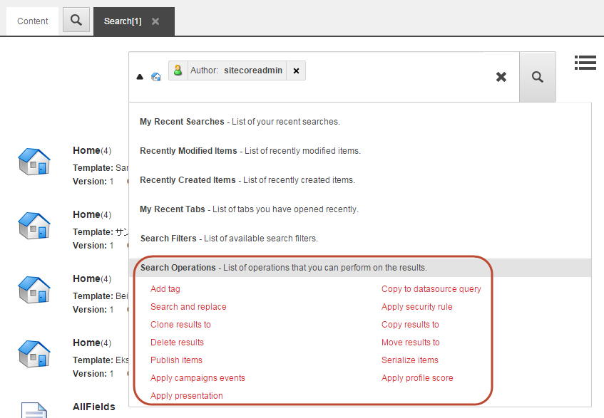
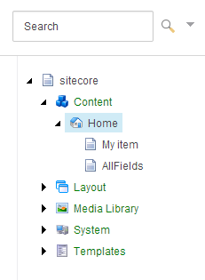

######################################################
アイテムを検索する
######################################################

Sitecoreでは、いくつかの方法でアイテムを検索することができます。

* コンテンツエディタから

    * コンテンツエディタから: コンテンツエリアの「検索」タブで、選択したアイテムのみを検索する。
    * コンテンツツリーでは、選択したアイテムを起点として、コンテンツツリー内のすべてのアイテムを検索します。

* エクスペリエンス エディタから

    * Navigate to Item ダイアログボックスで、Sitecore インストール内のすべてのアイテムを検索します。

*********************************************************************
コンテンツエディタまたはエクスペリエンスエディタでアイテムを検索する
*********************************************************************

.. important:: コンテンツエディタの「検索」タブで検索を実行すると、選択したアイテムの子孫のみを検索します。エクスペリエンスエディタでは、検索はすべてのSitecoreウェブサイトのすべてのアイテムを対象に実行されます。

アイテムを検索するには

1. コンテンツエディタまたはエクスペリエンスエディタを開きます。

    * コンテンツエディタのコンテンツツリーで、検索を実行したいアイテムに移動します。編集ペインで、Search |icon1| をクリックして、新しい検索タブを開きます。

    .. |icon1| image:: images/15ed64a1eef7a3.png

    .. image:: images/15ed64a1e7d9de.png
        :align: center
        :width: 400px
        :alt: パーソナライゼーション効果のトラッキング

    .. note:: アイテムバケットを選択すると、デフォルトで検索タブが開きます。

    * Experience Editor のリボンで、検索アイコンをクリックすると、Navigate to Item ダイアログボックスが開き、すべての Sitecore アイテムの中から検索することができます。

    .. image:: images/15ed64a1a58e0b.png
        :align: center
        :width: 400px
        :alt: パーソナライゼーション効果のトラッキング

2. 検索フィールドに、検索したいアイテムを特徴づけるキーワードを入力するか、クエリを作成します。

.. tip:: 検索フィールドに*を入力すると、利用可能なすべてのアイテムを検索することができます。コンテンツエディタでは、選択したアイテムのすべての子孫を意味し、エクスペリエンスエディタでは、Sitecoreインストール内のすべてのアイテムを意味します。

3. Enterキーを押すか、Search |icon2| をクリックします。

4. 検索結果をフィルタリングするには、検索結果の右側にあるファセットを使用し、検索結果の表示を変更するには、検索フィールドの右側にある |icon3| のいずれかの表示ボタンをクリックします。

.. note:: ビューを変更すると、[検索] フィールドのキーワードとフィルタのみに基づいて検索が再び開始されます。

検索結果では、クローンはグレーアウトされ、インデントで表示されることに注意してください。

5. 検索結果からアイテムを開くには

    * コンテンツ エディタで、アイテムのタイトルをクリックして新しいタブで開きます。

    .. image:: images/15ed64a1f13806.png
        :align: center
        :width: 400px
        :alt: パーソナライゼーション効果のトラッキング

    * エクスペリエンス エディタで、アイテムを選択して OK をクリックします。エクスペリエンスエディタは、選択したアイテムがあるページにリダイレクトします。

    .. tip:: 複数のウェブサイトで作業をしている場合は、他のウェブサイトでアイテムを検索し、この検索機能を使用して、あるサイトから別のサイトへとエクスペリエンスエディタにリダイレクトすることができます。

    .. image:: images/15ed64a1a5c8d5.png
        :align: center
        :width: 400px
        :alt: パーソナライゼーション効果のトラッキング

6. また、検索から直接すべてのアイテムに対して特定の操作を実行することもできます。検索結果のすべてのアイテムに対して操作を実行するには、検索フィールドの左側にある下向き矢印をクリックして検索操作を展開し、検索結果のすべてのアイテムに対して実行する操作を選択します。

**************************************************************************
コンテンツ エディタでコンテンツ ツリーからアイテムを検索する
**************************************************************************

コンテンツ ツリーをすばやく簡単に検索したい場合は、コンテンツ エディタのコンテンツ ツリーに関連付けられた検索機能を使用できます。

.. note:: 検索は、選択されたアイテムから始まるコンテンツツリー全体で実行されます。つまり、開始点で見つかった検索結果が最初に表示されます。

コンテンツツリー検索を使ってアイテムを検索するには

1. コンテンツ ツリーで、検索を開始するアイテムを選択します。
2. 検索フィールドに、検索するキーワードを入力します。これは、任意の文字、数字、単語などを指定できます。

3. Search をクリックするか、ENTERキーを押して検索を実行します。

****************************************************************
コンテンツ エディタのコンテンツ ツリーから検索に基準を追加する
****************************************************************

特定のフィールドで検索する必要がある場合、または 1 つ以上のアイテムやキーワードで検索する必要がある場合は、ドロップダウンメニューから、特定のフィールドで検索を実行し、検索に基準を追加することができます。

検索に基準を追加するには、以下の手順に従います。

1. コンテンツ ツリーで、検索を開始するアイテムを選択します。
2. 検索フィールドで、ドロップダウン矢印をクリックします。

    .. image:: images/15ed64a1f1c4c5.png
        :align: center
        :alt: コンテンツ エディタでコンテンツ ツリーからアイテムを検索する

3. アイテムの [名前] フィールドのみで検索を行うには、[名前] フィールドに検索するアイテムの名前を入力します。

   別のフィールドで検索する場合は、[名前] をクリックすると、表示されるドロップダウンメニューで、現在のアイテムのすべてのフィールドが表示されます。検索したいフィールドをクリックして、関連する検索ワードを入力します。

    .. image:: images/15ed64a1f2020d.png
        :align: center
        :alt: コンテンツ エディタでコンテンツ ツリーからアイテムを検索する

4. カスタム基準を追加するには、[基準の追加] フィールドに基準の名前を入力し、[基準の追加] をクリックします。

    .. image:: images/15ed64a1f23ef2.png
        :align: center
        :alt: コンテンツ エディタでコンテンツ ツリーからアイテムを検索する

    基準の名前をクリックして、事前に定義された基準のいずれかに変更することができます。

5. カスタム基準の値を入力し、ENTER を押します。基準を削除するには、基準名をクリックしてから、表示されるメニューの下部にある [削除] をクリックします。

6. コンテンツ領域で検索結果を開くには、検索結果をクリックします。

.. tip:: 英語版 https://doc.sitecore.com/users/93/sitecore-experience-platform/en/search-for-an-item.html

