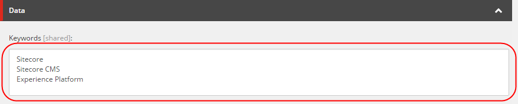

####################################
ブランディングキーワードの設定
####################################

Sitecore エクスペリエンス アナリティクスでは、あらかじめ定義されたブランドキーワードのリストを設定することができるので、ブランドキーワードと非ブランドキーワードを分けることができます。

ブランドキーワードには、自社のブランド名や企業固有の名前が含まれますが、ノンブランドキーワードには含まれません。ブランドキーワードとノンブランドキーワードを分けることで、マーケティング効果や顧客エンゲージメントの向上、ブランド認知度の測定が可能になります。

例えば、Sitecore、Sitecore CMS、Experience Platformというキーワードをリストに追加した場合、コンタクトがこれらのキーワードを検索エンジンで検索し、リンクをクリックしてhttps://www.sitecore.com にたどり着いたとき、エクスペリエンス アナリティクスはコンタクトが使用したキーワードをブランド化されたものとして識別します。

リストには、好きなだけブランド化されたキーワードを追加することができます。

ブランデッドキーワードを設定するには

1. コンテンツエディタのコンテンツツリーで、オーガニックブランドキーワードのアイテムに移動して選択します（sitecore/System/Settings/Analytics/Organic Branded Keywords）。

2. 右側のペインの [データ] セクションの [キーワード] フィールドに、ブランド検索を識別するキーワードを改行で区切って入力します。例えば、以下のように入力します。

3. [保存］をクリックします。

4. リボンの[発行]タブの[発行]グループで、[発行]ドロップダウン矢印をクリックし、[発行アイテム]をクリックします。

.. tip:: 英語版 https://doc.sitecore.com/users/93/sitecore-experience-platform/en/set-up-branded-keywords.html