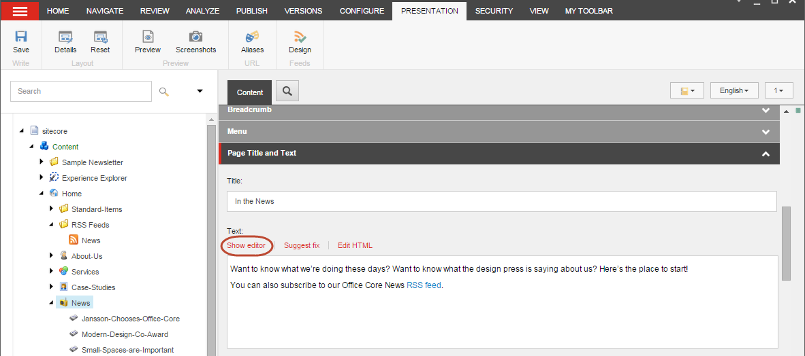

#############################
RSSフィードを設定する
#############################

コンテンツ エディターでは、どのようなアイテムに対してもRSSフィードを設定することができますが、一般的には、ニュースアイテムやブログなど、定期的に更新されるアイテムに対して設定することになります。

このチュートリアルでは、アイテムにRSSフィードを設定する方法と、その方法の概要について説明します。

************************************
RSSフィード用のフォルダを作成する
************************************

まず、RSSフィードの項目を保存するフォルダを作成する必要があります。

フィード用のフォルダを作成するには

1. コンテンツ エディターのコンテンツツリーで、ウェブサイトのホームアイテムを選択します。
2. [ホーム] タブの [挿入] グループで、ドロップダウン矢印をクリックし、[テンプレートから挿入] をクリックします。
3. [参照] タブをクリックし、[テンプレート/コモン/フォルダ] に移動します。

4. 新しいフォルダに名前を付けてください - RSSフィード。

******************************
RSSフィードを作成する
******************************

RSSフィードを保存するフォルダを作成したので、RSSフィードを作成して、RSSフィードに入れたいアイテムにリンクします。

コンテンツ エディターでRSSフィードを作成するには

1. コンテンツ エディターで、先ほど作成したRSSフィードフォルダを選択します。
2. [ホーム] タブの [挿入] グループで、[テンプレートから挿入] をクリックします。
3. [テンプレートから挿入] ダイアログ ボックスで、[テンプレート/システム/フィード/] に移動し、[RSS フィード] を選択して、このテンプレートに基づいてフィードを作成します。

.. image:: images/15eafd35730607.png
   :align: center
   :width: 400px
   :alt: RSSフィードを作成する

4. アイテム名フィールドに新しいフィードの名前を入力します。
5. [挿入］をクリックすると、新しいフィードアイテムが作成され、コンテンツ エディターで開きます。

.. image:: images/15eafd35736eeb.png
   :align: center
   :width: 400px
   :alt: RSSフィードを作成する

新しいフィードは警告を表示し、フィードが空であることと、フィードに含めるアイテムを選択する必要があることを知らせます。

6. [コンテンツ] タブの [データ] セクションの [アイテム] フィールドで [リンクの挿入] をクリックします。
7. アイテムの挿入ダイアログボックスで、RSSフィードに含めるアイテムをクリックし、挿入をクリックします。

.. note:: サブアイテムがあるアイテムに対してのみRSSフィードを作成することができます。サブアイテムを持たないアイテムにRSSフィードを作成すると、Sitecoreはそのフィードが空であることを教えてくれます。

8. [説明] フィールドに RSS フィードの説明を入力します。
9. 新しいフィードアイテムを保存します。

**************************
RSSフィードの設定
**************************

さて、RSSフィードでフィード情報をどのように表示するかを設定する必要があります。フィードには、アイテムが更新されたことを購読者に伝えるのではなく、作成または更新された情報アイテムに関する情報が含まれている必要があります。

RSS フィードの表示方法を設定するには、以下の手順に従います。

1. コンテンツ エディタで、RSS フィードをリンクしたアイテムを展開し、そのサブアイテムの 1 つをクリックします。
2. [表示] タブの [フィード] グループで [デザイン] をクリックします。

3. RSS フィードのデザイン ダイアログ ボックスで、この RSS フィードを購読しているユーザーにフィードをどのように表示するかを指定します。

.. image:: images/15eafd3574a070.png
   :align: center
   :width: 400px
   :alt: RSSフィードを作成する

+---------------+-----------------------------------------------------------------------------------------------------------------------------------+
| フィールド    | 値                                                                                                                                |
+===============+===================================================================================================================================+
| タイトル      | フィードのタイトルに表示させたいアイテム欄です。                                                                                      |
+---------------+-----------------------------------------------------------------------------------------------------------------------------------+
| 本文          | フィードの本文に表示させたいアイテム欄です。                                                                                          |
+---------------+-----------------------------------------------------------------------------------------------------------------------------------+
| 日付          | フィードに表示する日付フィールドです。これは、例えば、アイテムが作成された日付、更新された日付、ニュースが適用された日付などです。|
+---------------+-----------------------------------------------------------------------------------------------------------------------------------+
| プレビュー    | 上記の選択を元にしたフィードのプレビューです。                                                                                    |
+---------------+-----------------------------------------------------------------------------------------------------------------------------------+

4. これらのフィールドを入力したら、[OK]をクリックします。
   [プレゼンテーション]タブの[フィード]グループで、[デザイン]ボタンに緑色のチェックマーク |icon2| が表示されるようになりました 。

.. important:: あるアイテムのデザインを指定すると、同じテンプレートに基づいている他のすべてのアイテムが同じようにフィードに表示されます。サブアイテムの一部が別のテンプレートに基づいている場合は、それらのアイテムがフィードでどのように表示されるかを指定し、RSSフィードのレンダリングを正しく設定する必要があります。

5. コンテンツ エディターで、変更内容を保存します。

フィードの表示方法を設定すると、RSSフィードアイテムに警告が表示されなくなります。

********************************************************
あなたのウェブサイトにRSSフィードへのリンクを作成
********************************************************

RSSフィードを設定したら、親アイテムにフィードへのリンクを作成して、ユーザーが自分のウェブサイトからフィードを購読できるようにする必要があります。

コンテンツ アイテムへのリンクを作成するには、以下の手順に従います。

1. コンテンツ エディタで、RSS フィードを作成したアイテム（例えば、「ニュース」など）を開きます。
2. コンテンツ エリアの [コンテンツ] タブで、[ページ タイトルとテキスト] セクションを展開し、[エディタを表示] をクリックします。

3. テキスト エディタでリンクのテキストを入力し、テキストを選択してから |icon1| をクリックします。

.. |icon1| image:: images/15eafd3575c3a3.png

4. リンクの挿入］ダイアログボックスの［内部リンク］タブで、先に作成したRSSフィードアイテムに移動するか、［検索］タブでRSSフィードを検索します。

.. image:: images/15eafd35762102.png
   :align: center
   :width: 400px
   :alt: RSSフィードを作成する

5. リンクをクリックしてリンクを作成します。
6. 変更内容を保存します。

.. tip:: 英語版 https://doc.sitecore.com/users/93/sitecore-experience-platform/en/setting-up-rss-feeds.html
