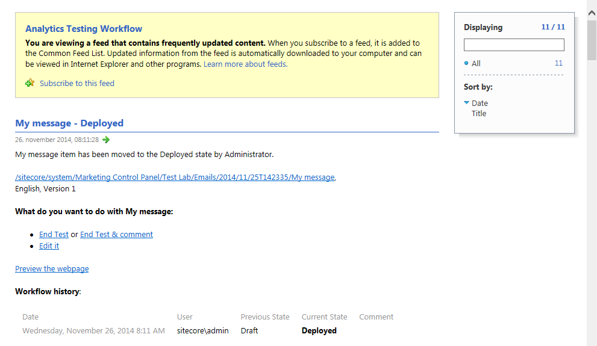

###########################################
クライアントのRSSフィードを購読する
###########################################

Sitecoreのアイテムやワークフローの更新情報を受け取るために、そのアイテムのクライアントRSSフィードを購読することができます。

Sitecoreでは、3種類のクライアントRSSフィードがあります。

* アイテムフィード - アイテムやアイテムのバージョンが通過するワークフローの状態を最新の状態に保つことができます。これは、コンテンツ制作者が特定のアイテムを追跡するのに便利です。

* ワークフローフィード - ワークフロー全体の最新情報を提供します。ワークフローに含まれるすべてのワークフローの状態にアクセスできる管理者やスーパーユーザーに便利です。

* ワークフロー状態フィード - このクライアントフィードは、特定のワークフロー状態の最新情報を保持します。これは、特定のワークフローの状態にのみアクセスできるコンテンツ作成者や管理者に便利です。

*****************************
アイテムのフィードを購読する
*****************************

アイテムフィードを購読すると、そのアイテムやバージョンのワークフローの状態が変わるたびに更新情報を受け取ることができます。

.. note:: アイテムがワークフローの対象となっている場合にのみ、RSSフィードには有用な情報が含まれています。

アイテムのクライアント RSS フィードを購読するには、以下の手順に従います。

1. コンテンツ エディタで、購読する項目に移動します。
2. [レビュー] タブをクリックし、[プルーフィング] グループで [購読] をクリックします。

.. image:: images/15eafd352e4f5e.png
   :align: center
   :width: 400px
   :alt: クライアントのRSSフィードを購読する

3. 開いたウェブページで、「このフィードを購読する」をクリックします。

4. このフィードを購読するダイアログボックスで、フィードの適切な名前と場所を入力し、「お気に入りバーに追加」チェックボックスを選択し、「OK」をクリックします。

*********************************
ワークフローのフィードを購読する
*********************************

ワークフローフィードを購読すると、そのアイテムの更新情報を受け取ることができます。

* ワークフローフィードは、アイテムの状態が変更されるたびに配信されます。
* ワークフローの状態は、アイテムのバージョンが特定のワークフロー状態に入るたび、または退出するたびにフィードされます。

ワークフロー フィードを購読するには

1. スタート画面から、ワークボックスをクリックします。

.. image:: images/15eafd35304b62.png
   :align: center
   :width: 400px
   :alt: クライアントのRSSフィードを購読する

または、コンテンツエディタから下部のページバーにある「ワークボックス」を開くこともできます。

.. image:: images/15eafd3530b9b7.png
   :align: center
   :width: 400px
   :alt: クライアントのRSSフィードを購読する

2. ワークボックス] リボンの [ワークフロー] グループで、購読するワークフローを選択します。

* ワークフローのフィードを購読するには、ワークフローの右側にある RSS フィード |icon1| をクリックします。
* ワークフローの状態フィードを購読するには、ワークフローの状態の右側にある RSS フィード |icon1| をクリックします。

3. 開いたウェブページで、「このフィードを購読する」をクリックします。

4. このフィードを購読するダイアログボックスで、フィードの適切な名前と場所を入力し、「お気に入りバーに追加」チェックボックスを選択し、「OK」をクリックします。

*********************************
クライアントのRSSフィードを見る
*********************************

ブラウザで購読しているクライアントのRSSフィードをすべて表示することができます。Internet Explorerで、[お気に入り]パネルの[フィード]タブをクリックして、項目のフィードへのリンクをクリックします。

.. image:: images/15eafd35329ca1.png
   :align: center
   :width: 400px
   :alt: クライアントのRSSフィードを購読する

このウェブページには、以下のようなアイテムに関する情報が含まれています。

* アイテムの名前。
* 現在のワークフローの状態。
* アイテムのワークフロー履歴
* 新バージョンと旧バージョンの違いを示す表。

.. image:: images/15eafd3532ff44.png
   :align: center
   :width: 400px
   :alt: クライアントのRSSフィードを購読する

さらに、クライアントの RSS フィードには、適切な権限を持っていれば、ワークフローを介してアイテムを移動させることができるいくつかのワークフローコマンドが含まれています。この例では、ユーザーは以下のことができます。

* 項目を承認または拒否します。
* 項目を承認または拒否し、コメントを挿入します。
* 項目を編集します。

.. important:: クライアントのRSSフィードからタスクを実行したい場合は、Sitecoreのログイン情報を入力して適切なページに誘導する必要があります。ただし、SitecoreのログインページでRemember meチェックボックスを選択すると、Sitecoreはあなたのログインを記憶しており、自動的にページに誘導されます。

.. tip:: 英語版 https://doc.sitecore.com/users/93/sitecore-experience-platform/en/subscribe-to-a-client-rss-feed.html
