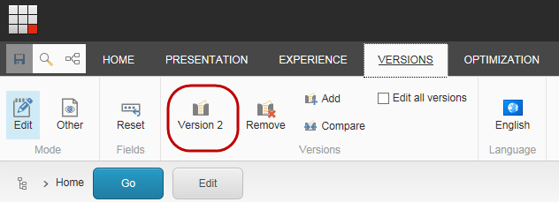

###########################################
アイテムのバージョンを切り替える
###########################################

アイテムのバージョンが複数ある場合、またはアイテムの言語バージョンが複数ある場合は、利用可能なすべてのバージョンの概要を取得し、それらの間で素早く切り替えることができます。

アイテムの別のバージョンまたは言語バージョンに切り替えるには、以下の手順に従います。

1. コンテンツ エディタまたはエクスペリエンス エディタで、該当する項目またはページに移動します。

2. 選択した言語で利用可能な全アイテムのバージョンの一覧を表示するには。

  * コンテンツ エディタで、コンテンツ領域の右上隅にあるバージョン番号 |icon1| をクリックします。

.. |icon1| image:: images/15eafd35599c4f.png

* エクスペリエンスエディタで、バージョングループのバージョンをクリックします。

3. 表示したいバージョンをクリックします。

.. note::  クリックしたバージョンが、エクスペリエンス エディタのエクスペリエンス タブで指定した日付内に利用可能な最新の発行可能バージョンでない場合、どのバージョンが最新の発行可能バージョンであるかを通知するための通知が表示されます。

4. アイテムの言語バージョンを表示するには

  * コンテンツエディタで、コンテンツエリアの右上隅にある言語バージョン |icon2| をクリックします。

* エクスペリエンスエディタの［バージョン］タブの［言語］グループで、［現在の言語を変更する］ |icon3| をクリックします。

.. |icon3| image:: images/15eafd355bb7fc.png

5. 別のバージョンに切り替えるには、バージョン番号または言語ドロップダウンメニューで該当するバージョンをクリックします。

.. tip:: 英語版 https://doc.sitecore.com/users/93/sitecore-experience-platform/en/switch-between-the-versions-of-an-item.html
