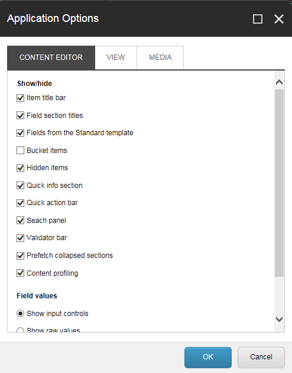
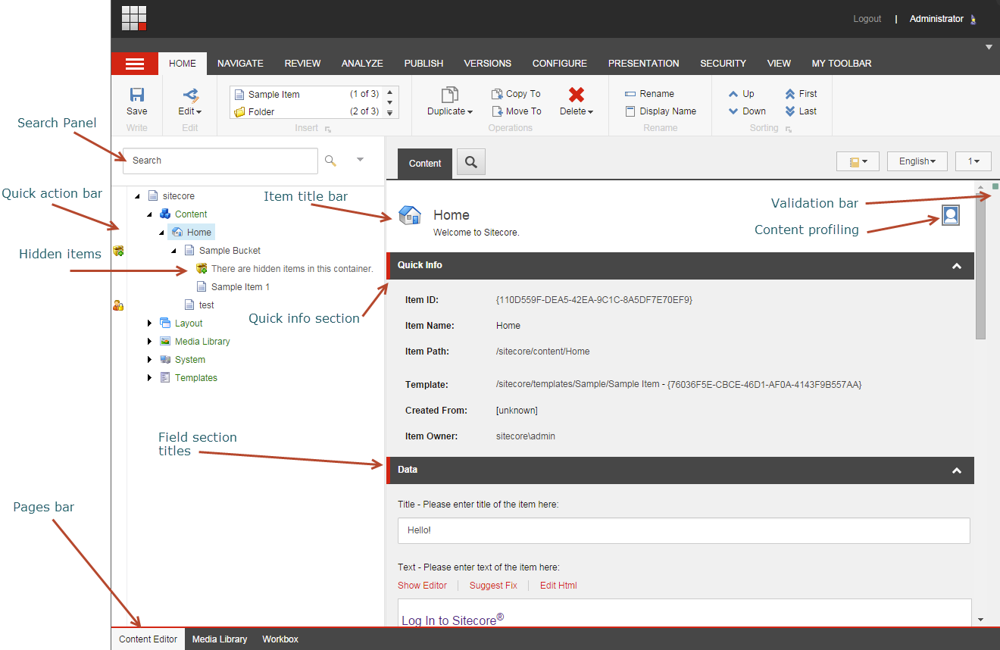

###################################
アプリケーションオプション
###################################

[アプリケーション オプション] ダイアログ ボックスでは、コンテンツ エディタで表示する要素と、:doc:`メディアライブラリ <the-media-library>` にメディア ファイルをアップロードするときにドラッグ アンド ドロップ ダイアログ ボックスで表示する要素を指定できます。

*********************************
コンテンツエディタタブ
*********************************

このトピックでは、[アプリケーション オプション] ダイアログ ボックスの各タブについて説明します。

+-----------------+----------------------------------------+---------------------------------------------------------------------------------------------------------------------------------------------------------------------------------------------------------------------------------------------------------+
| セクション      | フィールド                             | 説明                                                                                                                                                                                                                                                    |
+=================+========================================+=========================================================================================================================================================================================================================================================+
| 表示/非表示     | アイテムタイトルバー                   | アイテムタイトルバーを表示または非表示にします。                                                                                                                                                                                                        |
+                 +----------------------------------------+---------------------------------------------------------------------------------------------------------------------------------------------------------------------------------------------------------------------------------------------------------+
|                 | フィールドセクションのタイトル         | フィールドセクションのタイトルを表示または非表示にします。                                                                                                                                                                                              |
+                 +----------------------------------------+---------------------------------------------------------------------------------------------------------------------------------------------------------------------------------------------------------------------------------------------------------+
|                 | 標準テンプレートのフィールド           | Sitecoreが内部的に使用する多数のフィールドを表示します。これらはパフォーマンスを向上させるために非表示にしています。                                                                                                                                    |
+                 +----------------------------------------+---------------------------------------------------------------------------------------------------------------------------------------------------------------------------------------------------------------------------------------------------------+
|                 | バケットアイテム                       | そうでなければ隠されたアイテムをフォルダ構造のアイテムバケットに表示します。このチェックボックスをオフにすると、システムがコンテンツツリー内のすべてのアイテムを不必要に読み込むことを防ぐことができるので、このチェックボックスをオフにしてください。  |
+                 +----------------------------------------+---------------------------------------------------------------------------------------------------------------------------------------------------------------------------------------------------------------------------------------------------------+
|                 | 隠しアイテム                           | コンテンツ ツリーに隠されたアイテムを表示または非表示にします。                                                                                                                                                                                         |
+                 +----------------------------------------+---------------------------------------------------------------------------------------------------------------------------------------------------------------------------------------------------------------------------------------------------------+
|                 | クイックインフォ                       | クイック情報セクションを表示または非表示にします。                                                                                                                                                                                                      |
+                 +----------------------------------------+---------------------------------------------------------------------------------------------------------------------------------------------------------------------------------------------------------------------------------------------------------+
|                 | クイックアクションバー                 | クイックアクションバーを表示または非表示にします。                                                                                                                                                                                                      |
+                 +----------------------------------------+---------------------------------------------------------------------------------------------------------------------------------------------------------------------------------------------------------------------------------------------------------+
|                 | 検索パネル                             | 検索パネルを表示または非表示にします。                                                                                                                                                                                                                  |
+                 +----------------------------------------+---------------------------------------------------------------------------------------------------------------------------------------------------------------------------------------------------------------------------------------------------------+
|                 | 検証バー                               | Validator バーを表示または非表示にします。                                                                                                                                                                                                              |
+                 +----------------------------------------+---------------------------------------------------------------------------------------------------------------------------------------------------------------------------------------------------------------------------------------------------------+
|                 | 折りたたまれたセクションをプリフェッチ | システムは、フィールドセクションが開かれる前に、フィールドセクションからフィールドをフェッチしてメモリに保持します。                                                                                                                                    |
+                 +----------------------------------------+---------------------------------------------------------------------------------------------------------------------------------------------------------------------------------------------------------------------------------------------------------+
|                 | コンテンツプロファイリング             | コンテンツ プロファイリング ボタンを表示または非表示にします。                                                                                                                                                                                          |
+-----------------+----------------------------------------+---------------------------------------------------------------------------------------------------------------------------------------------------------------------------------------------------------------------------------------------------------+
| フィールドの値  | 入力コントロールを表示する             | フィールドの値を入力コントロールとして表示します。これは管理者のみに関連しています。                                                                                                                                                                    |
+                 +----------------------------------------+---------------------------------------------------------------------------------------------------------------------------------------------------------------------------------------------------------------------------------------------------------+
|                 | ローデータを表示                       | フィールドの値をローデータとして表示します。これは管理者のみに関連しています。                                                                                                                                                                          |
+-----------------+----------------------------------------+---------------------------------------------------------------------------------------------------------------------------------------------------------------------------------------------------------------------------------------------------------+
| ページ          | ページバーを表示                       | コンテンツ エディターの下部にSitecoreアプリケーションへのショートカットを表示するかどうかを決定します。                                                                                                                                                 |
+-----------------+----------------------------------------+---------------------------------------------------------------------------------------------------------------------------------------------------------------------------------------------------------------------------------------------------------+

*********************************
ビュータブ
*********************************

[表示] タブでは、コンテンツ ツリー、コンテンツ エディタ、マーケティング センターに表示される内容を決定するオプションが増えました。

+---------------------------------+--------------------------------------------------+--------------------------------------------------------------------------------------------------------------------------------------------------+
| セクション                      | フィールド                                       | 説明                                                                                                                                             |
+=================================+==================================================+==================================================================================================================================================+
| コンテンツツリー - アイテム名   | 表示名(言語固有名)                               | アイテムタイトルバーを表示または非表示にします。                                                                                                 |
+                                 +--------------------------------------------------+--------------------------------------------------------------------------------------------------------------------------------------------------+
|                                 | アイテムキー                                     | 選択すると、コンテンツツリーにアイテムキーが表示されます。                                                                                       |
+---------------------------------+--------------------------------------------------+--------------------------------------------------------------------------------------------------------------------------------------------------+
| コンテンツツリーのルート        | コンテンツ エディタでコンテンツ ツリーを表示する | コンテンツ エディタでコンテンツ ツリーを表示する                                                                                                 |
+                                 +--------------------------------------------------+--------------------------------------------------------------------------------------------------------------------------------------------------+
|                                 | コンテンツツリー全体を表示                       | コンテンツ エディタでコンテンツ ツリー全体を表示します。チェックボックスをオフにすると、コンテンツ ツリーのコンテンツ ノードのみが表示されます。 |
+---------------------------------+--------------------------------------------------+--------------------------------------------------------------------------------------------------------------------------------------------------+
| コントロールプロパティ          | パーソナライゼーションセクションを表示する       | マーケティングセンターでのみ使用すること。                                                                                                       |
+                                 +--------------------------------------------------+--------------------------------------------------------------------------------------------------------------------------------------------------+
|                                 | テストラボセクションを表示する                   | マーケティングセンターでのみ使用すること。                                                                                                       |
+---------------------------------+--------------------------------------------------+--------------------------------------------------------------------------------------------------------------------------------------------------+

*********************************
メディアタブ
*********************************

[メディア］タブでは、［ドラッグ＆ドロップ］ダイアログボックスで表示する内容を指定したり、ユーザーのコンピュータで利用可能な編集アプリケーションを開くかどうかを指定することができます。

.. note:: ドラッグ＆ドロップ機能は、現在のところInternet Explorer 7以降でのみサポートされています。Mozilla Firefoxなどの別のブラウザを使用している場合は、ファイルをメディアライブラリにアップロードするには、ファイルのアップロードとファイルのアップロード(詳細)オプションを使用する必要があります。

+---------------------------------+--------------------------------------------------------------------------------+--------------------------------------------------------------------------------------------------------+
| セクション                      | フィールド                                                                     | 説明                                                                                                   |
+=================================+================================================================================+========================================================================================================+
| ドラッグ＆ドロップ              | 最新バージョンのファイルのみを表示                                             | ドラッグ＆ドロップダイアログボックスでメディアファイルの最新バージョンのみを表示する場合に選択します。 |
+                                 +--------------------------------------------------------------------------------+--------------------------------------------------------------------------------------------------------+
|                                 | バージョン管理されたファイルをフォルダに表示                                   | ドラッグ＆ドロップダイアログボックスでメディアファイルのすべてのバージョンを表示する場合に選択します。 |
+---------------------------------+--------------------------------------------------------------------------------+--------------------------------------------------------------------------------------------------------+
| メディア編集ボタンのデフォルト  | ユーザーのコンピュータにインストールされている編集アプリケーションを開きます。 | ユーザーのコンピュータにインストールされている編集アプリケーションでメディアアイテムを開きます。       |
+---------------------------------+--------------------------------------------------------------------------------+--------------------------------------------------------------------------------------------------------+

.. tip:: 英語版 https://doc.sitecore.com/users/93/sitecore-experience-platform/en/the-application-options.html
