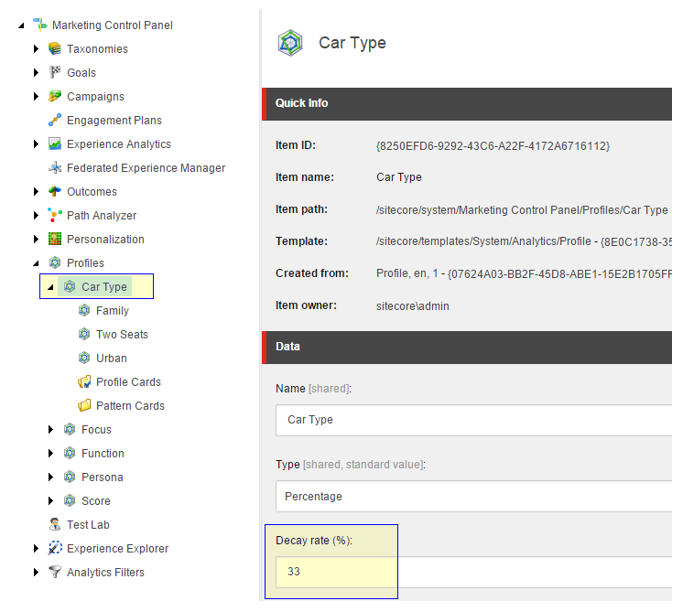

##############################################
コンタクト行動プロファイル
##############################################

コンタクトの行動プロファイルには、コンタクトの過去のプロファイルマッチに関する情報が含まれています。これには、マッチしたプロファイル、プロファイルカード、ペルソナなどの :doc:`コンテンツプロファイリング <content-profiling>` 情報が含まれます。コンテンツのプロファイリングにより、コンタクトの組織との相互作用をより深く理解した上で、コンタクトに関連性のあるパーソナライズされたコンテンツを提供することができます。

.. note:: CMSのみのモードでExperience Managementを実行し、Xdb.Enabledをfalseに設定している場合、コンタクトの動作プロファイルは機能せず、xDB内の共有セッションにデータは保存されません。

****************************
接触行動プロファイルの使用
****************************

マーケティングコントロールパネルでは、減衰率を設定することで、個々のプロファイルまたはパターンカードが接触行動プロファイルにどれくらいの期間関連しているかを制御することができます。減衰率は、そのプロファイルが時間の経過とともにどれだけ関連性を維持するかを表すパーセンテージです。

コンタクトの行動プロファイルの値に基づいて :doc:`パーソナライズルール <the-rule-set-editor>` を実装し、現在のプロファイルの一致ではなく、過去のプロファイルの一致に基づいてパーソナライズされたコンテンツを表示することができます。これにより、連絡先と組織との関係の中で、より関連性の高い情報を連絡先に提供することができます。

.. tip:: https://doc.sitecore.com/users/93/sitecore-experience-platform/en/the-contact-behavior-profile.html
