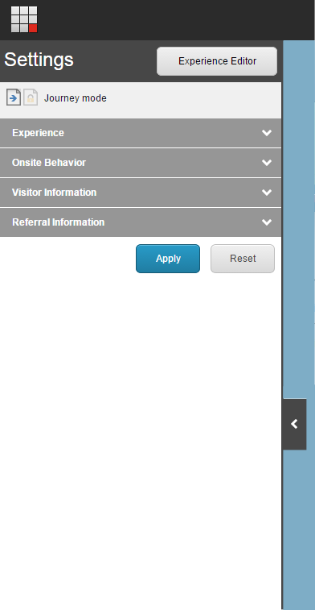

#######################################
エクスプローラー モードの設定
#######################################

エクスペリエンスモードでは、設定パネルはウェブページの左側にあります。ヘッダーには、訪問者体験のために選択した訪問タイプが表示されます。

* ジャーニーモード - プリセットされた値が訪問の出発点となります。ウェブサイト内を移動すると、エンゲージメントバリューポイントが蓄積され、パーソナライゼーションなどでサイトに加えられた変更を監視することができます。
* 固定モード - プリセットされた値は永続的で、ウェブサイトを移動しても変更されません。パーソナライゼーションを含むページにアクセスすると、ページの変更が表示されますが、別のページに移動するとすべての変更がクリアされます。固定モードでの訪問中は、エンゲージメントポイントは蓄積されません。

.. note:: エクスプローラモードの場合、エクスペリエンスエディタのリボンは無効になっています。エクスペリエンス エディタ リボンを有効にするには、設定パネルの［エクスペリエンス エディタ］をクリックします。

次の表では、設定パネルで使用できるオプションについて説明します。

.. note:: この表に記載されているExploreモードのオプションは、Webサイトをどのように実装したかによって異なる場合があります。例えば、Sitecoreをインストールした場合、利用可能なプリセットはDefaultとAnonymousのみです。

+--------------+----------------+-----------------------------------------+---------------------------------------------------------------------------------------------------------------------------------------------+
| セクション   | 設定           | オプション                              | 概要                                                                                                                                        |
+--------------+----------------+-----------------------------------------+---------------------------------------------------------------------------------------------------------------------------------------------+
| Experience   | プリセット     | ・ 標準                                 | ウェブサイトを移動する際に使用するプリセットを選択します。                                                                                  |
|              |                | ・ 匿名                                 | 各プリセットは、ペルソナと他のいくつかの設定で構成されており、異なるタイプの訪問者の視点からウェブサイトを体験することができます。          |
|              |                | ・ 作成するプリセット                   | 今回の訪問では、既存のプロファイルキーに値を追加することができます。                                                                        |
+--------------+----------------+-----------------------------------------+---------------------------------------------------------------------------------------------------------------------------------------------+
| 現場での行動 | プロファイル   | Web サイト用に作成したプロファイルキー  | 今回の訪問では、既存のプロファイルキーに値を追加することができます。                                                                        |
|              |                |                                         |                                                                                                                                             |
|              |                | 例えば                                  |                                                                                                                                             |
|              |                | ・ 訪問プロファイル                     |                                                                                                                                             |
|              |                | ・ ビジネス                             |                                                                                                                                             |
|              |                | ・ カップル                             |                                                                                                                                             |
|              |                | ・ 滞在期間                             |                                                                                                                                             |
|              |                | ・ ファミリー                           |                                                                                                                                             |
|              |                | ・ リピート訪問                         |                                                                                                                                             |
|              |                | ・ ツアー                               |                                                                                                                                             |
|              +----------------+-----------------------------------------+---------------------------------------------------------------------------------------------------------------------------------------------+
|              | ゴール         | 目標のリスト                            | 訪問中にトリガーさせたい目標を選択します。                                                                                                  |
|              |                |                                         |                                                                                                                                             |
|              |                | 例えば、                                |                                                                                                                                             |
|              |                | ・ 登録フォーム完成                     |                                                                                                                                             |
|              |                | ・ フリークエントチラシフォーム完成     |                                                                                                                                             |
|              |                | ・ フェイスブックがクリックした         |                                                                                                                                             |
+--------------+----------------+-----------------------------------------+---------------------------------------------------------------------------------------------------------------------------------------------+
|              | ページイベント | ページイベントのリスト。                | 訪問中にトリガーするページイベントを選択します。                                                                                            |
|              |                |                                         |                                                                                                                                             |
|              |                | 例えば、                                |                                                                                                                                             |
|              |                | ・ キャンペーン                         |                                                                                                                                             |
|              |                | ・ ダウンロード                         |                                                                                                                                             |
|              |                | ・ プリント                             |                                                                                                                                             |
|              |                | ・ RSS                                  |                                                                                                                                             |
+--------------+----------------+-----------------------------------------+---------------------------------------------------------------------------------------------------------------------------------------------+
| 訪問者情報   | デバイス       | リストのデバイス                        | 訪問時に使用するデバイスを選択します。                                                                                                      |
|              |                |                                         |                                                                                                                                             |
|              |                | ・ 標準                                 | ウェブサイトのレイアウトは、ご利用の特定のデバイスに応じて変化します。                                                                      |
|              |                | ・ プリント                             | 例えば、モバイル訪問者の視点でウェブサイトを体験したい場合は、モバイルデバイスを選択します。                                                |
|              |                | ・ フィード                             |                                                                                                                                             |
|              |                | ・ モバイル                             |                                                                                                                                             |
|              |                | ・ タブレット                           |                                                                                                                                             |
|              +----------------+-----------------------------------------+---------------------------------------------------------------------------------------------------------------------------------------------+
|              | GeoIP          | 地図                                    | 今回の訪問に使用するGEOIP情報を入力し、[適用]をクリックします。この情報はMaxMindのルックアップに使用することができます。                    |
|              |                |                                         |                                                                                                                                             |
|              |                |                                         | 地図をクリックして訪問先を指定するか、該当する緯度・経度を入力してください。                                                                |
|              |                +-----------------------------------------+---------------------------------------------------------------------------------------------------------------------------------------------+
|              |                | 国                                      | 訪問時に利用する国を選択してください。                                                                                                      |
|              |                +-----------------------------------------+---------------------------------------------------------------------------------------------------------------------------------------------+
|              |                | IP *                                    | 訪問時に使用するIPアドレスを入力します。                                                                                                    |
+--------------+----------------+-----------------------------------------+---------------------------------------------------------------------------------------------------------------------------------------------+
| 参照情報     | キャンペーン   | キャンペーンの一覧です。                | 訪問中にトリガーさせたいキャンペーンを検索または選択します。                                                                                |
|              |                |                                         |                                                                                                                                             |
|              |                | 例えば                                  |                                                                                                                                             |
|              |                | ・ 頻繁に行われるチラシ販促キャンペーン |                                                                                                                                             |
|              |                | ・ ホームフォーホリデーキャンペーン     |                                                                                                                                             |
+--------------+----------------+-----------------------------------------+---------------------------------------------------------------------------------------------------------------------------------------------+
| リファラル   | リファラル     | リファラル参照フィールド                | あなたのサイトにリンクしているウェブサイトのURLを入力します。または、GoogleやBingなどの検索エンジンからキーワードを入力することもできます。 |
+--------------+----------------+-----------------------------------------+---------------------------------------------------------------------------------------------------------------------------------------------+

* GEOIP設定では、IPと国など複数のオプションを選択した場合、競合する可能性があります。この場合、ビューアパネルにはIPアドレスに応じた情報のみが表示されます。IP アドレスを指定しない場合は、国別に表示されます。

.. note::

  [設定] パネルまたは [ビューア] パネルのセクションの順序を変更したい場合は、開発者または管理者に連絡してください。
  また、ロールベースのパーミッションを使用して、パネル内の特定のセクションを非表示にしたり、表示したりすることもできます。たとえば、GEOIP とキャンペーンの設定にのみアクセスできる専用の Explore mode Marketer ロールを作成することができます。

.. tip:: 英語版 https://doc.sitecore.com/users/93/sitecore-experience-platform/en/the-explore-mode-settings.html

