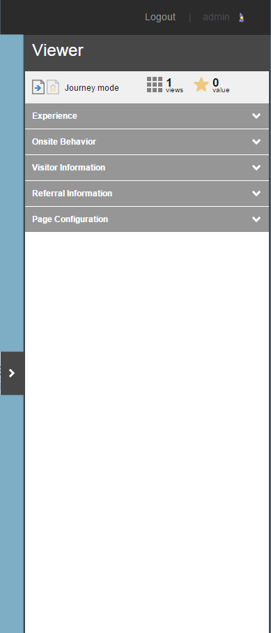

#######################################
エクスプローラモードのビューアパネル
#######################################

エクスペリエンスモードでは、ビューアパネルはウェブページの右側にあります。

ビューアパネルのヘッダーが表示されます。

* 訪問者体験のために選択したモード。ジャーニーモードと固定モードの2つのオプションがあります。
* 現在のページビューの合計数。
* 訪問中に蓄積されたエンゲージメントバリューポイントの現在の合計。

以下の表では、ビューアパネルで利用できる情報について説明します。

.. note:: この表に記載されているExploreモードのオプションは、Webサイトをどのように実装したかによって異なる場合があります。例えば、Sitecoreをインストールした場合、利用可能なプリセットはDefaultとAnonymousのみです。

+------------------+------------------+------------------------------------------------------------------------------------------------------------------------------------------------------------+
| セクション       | 設定             | 概要                                                                                                                                                       |
+------------------+------------------+------------------------------------------------------------------------------------------------------------------------------------------------------------+
| エクスペリエンス | プリセット       | 選択したプリセットの名前を表示します。                                                                                                                     |
+------------------+------------------+------------------------------------------------------------------------------------------------------------------------------------------------------------+
| Onsite Behavior  | プロファイル     | 実装したプロファイリング戦略に応じて、どのプロファイリングパターンカードが、プリセットで訪問したページと最も密接に一致しているかを確認することができます。 |
|                  +------------------+------------------------------------------------------------------------------------------------------------------------------------------------------------+
|                  | ゴール           | 訪問中にトリガーされたゴールを表示します。                                                                                                                 |
|                  |                  | 目標は、ジャーニーモードで蓄積されるか、固定モードでページ上に表示されます。                                                                               |
|                  +------------------+------------------------------------------------------------------------------------------------------------------------------------------------------------+
|                  | ページイベント   | この訪問中にトリガされたページイベントを表示します。                                                                                                       |
+------------------+------------------+------------------------------------------------------------------------------------------------------------------------------------------------------------+
| 訪問者情報       | デバイス         | 今回の訪問で選択したデフォルトのデバイスを表示します。                                                                                                     |
|                  +------------------+------------------------------------------------------------------------------------------------------------------------------------------------------------+
|                  | Geo IP           | 設定パネルの訪問者情報セクションで最後に更新されたものに応じて、GoogleまたはBingの地図、国、またはIP情報を表示します。                                     |
|                  +------------------+------------------------------------------------------------------------------------------------------------------------------------------------------------+
|                  | タグ             | 訪問者に関連付けられている現在のタグを表示します。                                                                                                         |
+------------------+------------------+------------------------------------------------------------------------------------------------------------------------------------------------------------+
| 参照情報         | キャンペーン     | 今回の訪問に関連したキャンペーンを表示します。                                                                                                             |
|                  +------------------+------------------------------------------------------------------------------------------------------------------------------------------------------------+
|                  | リファラル       | この訪問に関連した参照サイトや検索キーワードを表示します。                                                                                                 |
+------------------+------------------+------------------------------------------------------------------------------------------------------------------------------------------------------------+
| ページ設定       | ルールと条件設定 | 現在のページに存在し、アクティブなルールと条件付きレンダリングが表示されます。                                                                             |
|                  |                  | ルールの上にマウスを置くと、ルールがどのように評価されるか、または前のルールが真ではない場合にどのように評価されるかが表示されます。                       |
+------------------+------------------+------------------------------------------------------------------------------------------------------------------------------------------------------------+

.. note:: [設定] パネルまたは [ビューア] パネルのセクションの順序を変更したい場合は、開発者または管理者に連絡してください。また、ロールベースのパーミッションを使用して、[設定] パネルまたは [ビューア] パネルの特定のセクションを非表示または表示にすることもできます。たとえば、Geo IP とキャンペーンのみにアクセスできる専用の Explore mode Marketer ロールを作成することができます。

.. tip:: 英語版 https://doc.sitecore.com/users/93/sitecore-experience-platform/en/the-explore-mode-viewer-panel.html

