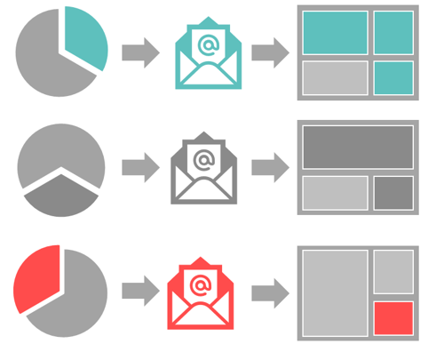
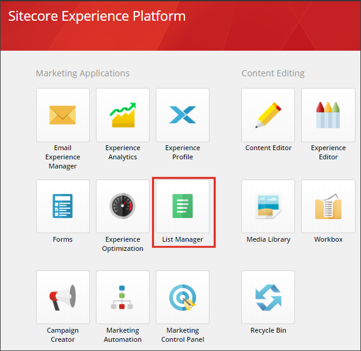

####################################
リスト マネージャー
####################################

メールマーケティングでは、誰にメールを送るかは、何を送るかと同じくらい重要です。リストマネージャーを使用して、コンタクトリストを管理し、セグメントを使用して、プロフィールやエンゲージメントデータに基づいて特定のオーディエンスをターゲットにした受信者リストを作成します。次に、メールエクスペリエンスマネージャーを使用して、受信者に関連性があり、個人的な内容のメールキャンペーンを作成することができます。

スタート画面からリストマネージャーを開きます。

*****************
リストタイプ
*****************

リストマネージャーでは、2種類のリストがあります。

* 連絡先リスト - 連絡先がメンバーになることができる標準リスト。1 つの連絡先は、1 つまたは複数の連絡先リストのメンバーになることができます。

  新しい連絡先リストを作成する際には、既存の連絡先リストを新しいリストの構成要素として使用することができます。例えば、既存の 2 つのコンタクト・リストから「北米 - 顧客」というリストを作成することができます。US - 顧客」と「CA - 顧客」という名前のリストを作成することができます。

* セグメント化されたリスト - 1 つ以上の選択された連絡先リストをフィルタリングしたリスト。セグメント化されたリストの連絡先は、実際にはリストのメンバーではなく、リストのソース (選択された連絡先リスト) にあり、定義した条件を満たしている場合にのみリストに表示されます。

  セグメント化されたリストは、リストのソース内の連絡先が定義された条件を満たすと、継続的に更新される動的リストです。

  セグメント化されたリストを新しい連絡先リストに変換することができます。これにより、セグメント化されたリストの「スナップショット」を取得し、変換時に定義された条件を満たす連絡先で新しい連絡先リストを作成することができます。

*****************
リストソース
*****************

リスト マネージャでリストを作成する場合、空の連絡先リストを作成するか、リストのソースを選択できます。

* コンタクトリストの場合、リストのソースには、既存のコンタクトリストを使用できます。

* セグメント化されたリストの場合、リストのソースは、すべてのSitecoreコンタクトまたは既存のコンタクトリストにすることができます。

.. note:: リストソースとして使用できるのは、連絡先リストのみです。セグメント化されたリストをリスト ソースとして使用する場合は、まず、セグメント化されたリストをコンタクト リストに変換する必要があります。

除外事項
=================

リストソースを修正するために、特定のコンタクトリストをソースから除外することも可能です。これにより、ターゲットグループをさらに絞り込むことができます。例えば、カナダの顧客リストを除外することで、北米リストの米国の顧客をターゲットにすることができます。

また、品質保証の目的で、購読していない顧客を除外するなどの目的で除外機能を使用することもできます。

.. important::

    コンタクトリストの定義は、Marketing Operations API を使用してアクティブ化された場合、またはアクティブ化フラグが True に設定されて保存された場合にのみインデックスに表示されます。

    manager.SaveAsync(contactList, true);

    あるいは、コンタクトリストが作成されているがアクティブ化されていない場合は、Draft 状態を Deployed に変更することで、ワークフローの一部としてアクティブ化することができます。

.. tip:: 英語版 https://doc.sitecore.com/users/93/sitecore-experience-platform/en/the-list-manager.html