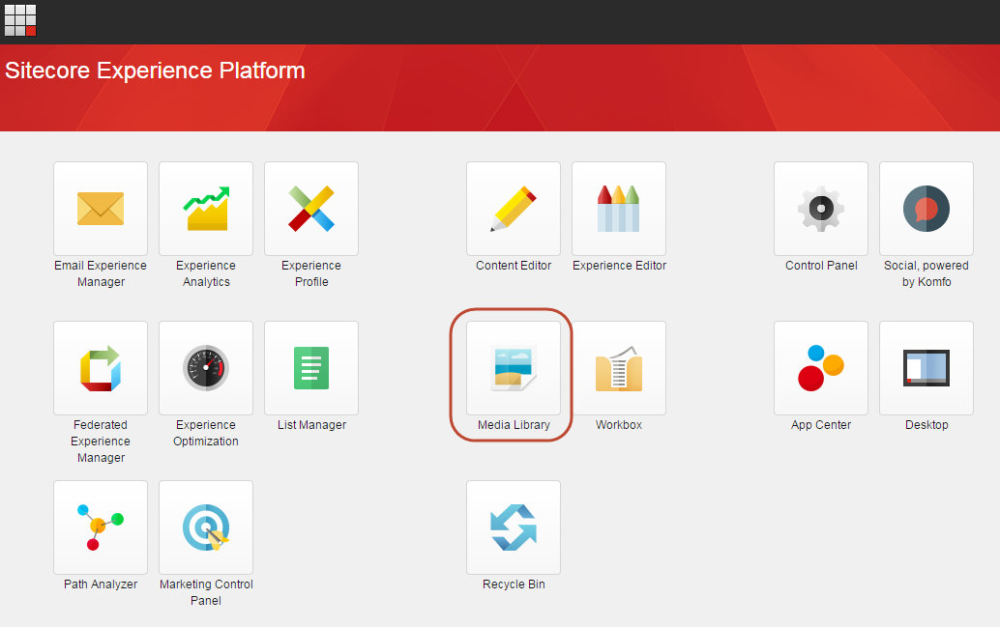
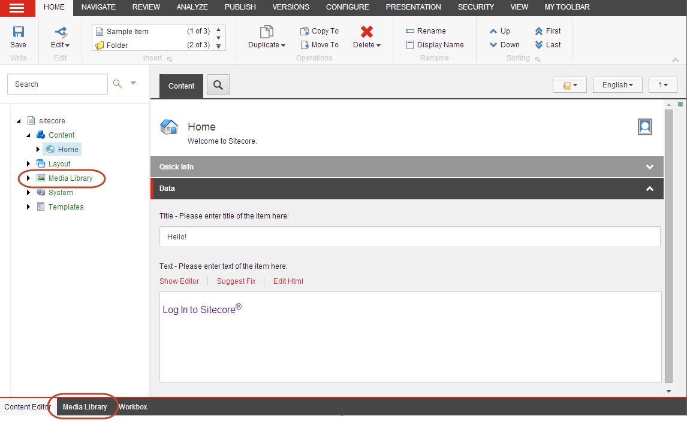
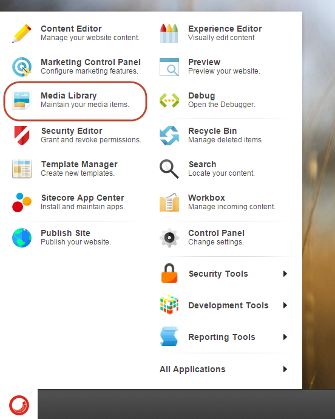
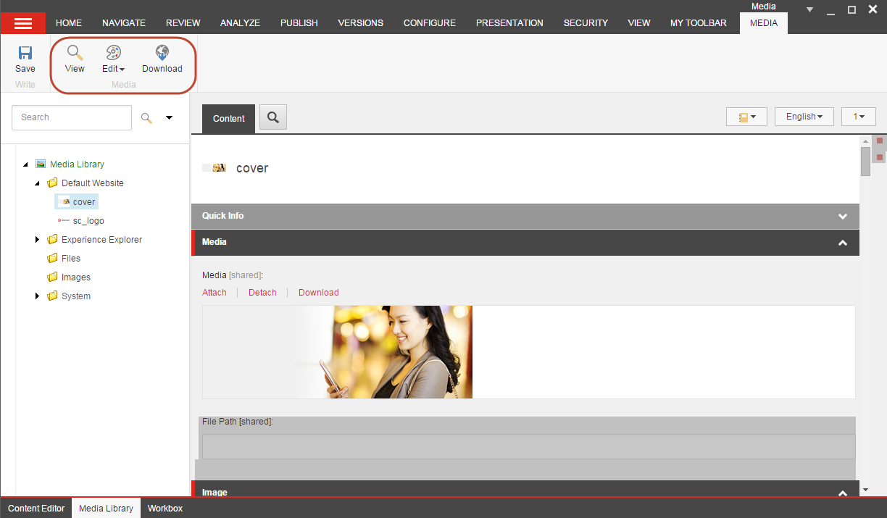
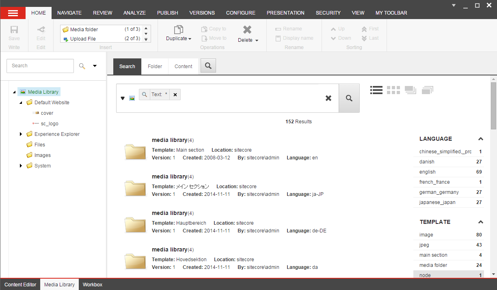
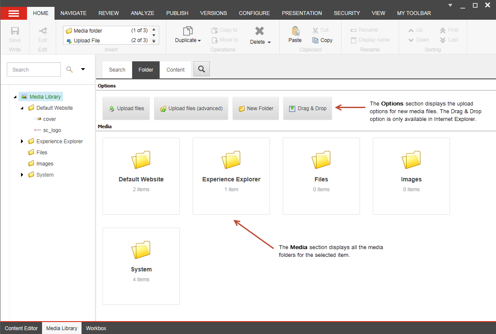
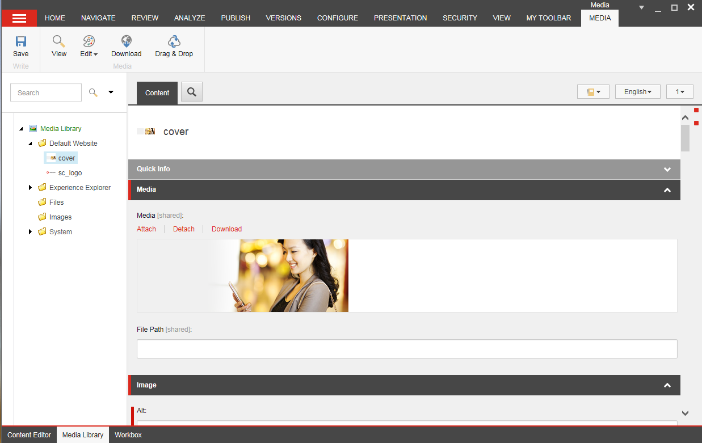

##############################
メディアライブラリ
##############################

ウェブページに埋め込んだり、訪問者がダウンロードできるようにしたい画像など、メディアライブラリからすべてのメディアアイテムを管理できます。メディア ライブラリには、画像、ドキュメント、ビデオ、オーディオ ファイルなどのすべてのメディア アイテムが含まれています。

メディア ライブラリでは、以下のことができます。

* すべてのメディアファイルを一箇所にまとめ、コンテンツツリーに似たフォルダ構造で整理します。
* コンテンツツリーをナビゲートするか、Sitecoreの検索機能を使用して、メディアアイテムを素早く見つけることができます。
* メディアライブラリにメディアファイルをアップロードします。アップロードボタンを使ってコンピュータをブラウズして画像を探したり、ドラッグ＆ドロップダイアログボックスを使ってメディアファイルを追加したりすることができます。
* すべてのメディアコンテンツアイテムとメディアファイルをバージョン管理可能にします。

.. note:: 画像を編集するには、SitecoreのImage Editorを使用することができます。

*************************
メディアライブラリを開く
*************************

メディアライブラリは以下の場所から開くことができます。

The Launchpad
==================

Media Libraryに移動するには、Sitecore LaunchpadでMedia Libraryアイコンをクリックします。

コンテンツエディター
======================

コンテンツ エディタで、コンテンツ ツリーのメディア ライブラリに移動します。メディア ライブラリを個別に開く場合は、コンテンツ エディタの下部にあるページ バーで メディア ライブラリ をクリックします。

デスクトップ
==================

Media Libraryを開くには、Sitecore Startボタンをクリックし、Media Libraryをクリックします。

****************************************************
メディア ライブラリのユーザー インターフェイス
****************************************************

リボン
==================

[メディア ライブラリ] では、リボン上のオプションはコンテンツ エディタと同じですが、[挿入] グループでは新しいメディア フォルダの作成やメディア ファイルのアップロードができます。

コンテンツ ツリーでメディア アイテムを選択すると、リボンに [メディア] タブが表示されます。ここには、新しいメディア グループと、そのメディア アイテムで実行できるアクションが含まれています。

.. note:: リボンの機能は、ウェブサイト管理者によって割り当てられたユーザー権限と、選択したメディア アイテムの種類によって異なります。

コンテンツツリー
==================

コンテンツ ツリーまたは検索を使用して、メディア アイテムを検索します。コンテンツ ツリーでフォルダを展開すると、すべてのサブフォルダとメディア アイテムが表示され、サブフォルダを非表示にするには、再度フォルダを折りたたむ必要があります。

すべてのメディア アイテムをフォルダに保存し、フォルダには意味のある名前を付けてください。メディア ライブラリのフォルダ構造を整理する簡単な方法は、ウェブサイトの構造を反映させることです。例えば、サイトに4つのメインセクションがある場合。ホーム」、「製品」、「仕事」、「お問い合わせ」の4つのセクションがある場合、同じ名前のフォルダを4つ作成して、すべての画像やその他のメディアを保存することができます。これにより、サイトが成長してメディアアイテムを更新する必要が出てきたときに、メディアアイテムを簡単に見つけることができるようになります。

コンテンツエリア
==================

コンテンツ エリアには、特定のメディア アイテムを操作する際に使用できる以下のタブが表示されます。

検索タブ
----------

このタブには精巧な検索機能があり、メディア ライブラリ内の数千ものアイテムの中から特定のアイテムを探すのに役立ちます。メディア・ライブラリは、デフォルトでは[検索]タブで開き、メディア・ライブラリ内のすべてのアイテムの検索がすでに実行されています。

フォルダタブ
-------------

このタブには、メディア ライブラリで選択したフォルダのオプションとメディア コンテンツが表示されます。

コンテンツタブ
---------------

このタブには、選択したメディアアイテムの編集可能なすべてのフィールドが表示されます。

.. tip:: 英語版 https://doc.sitecore.com/users/93/sitecore-experience-platform/en/the-media-library.html
