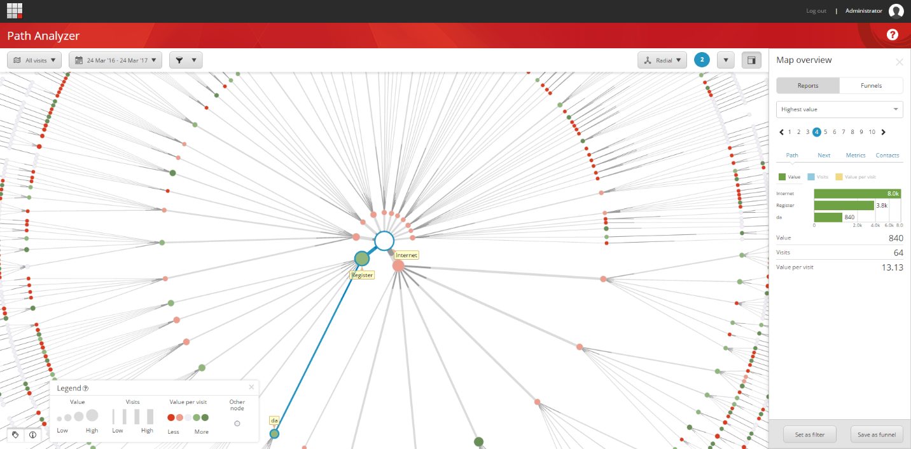
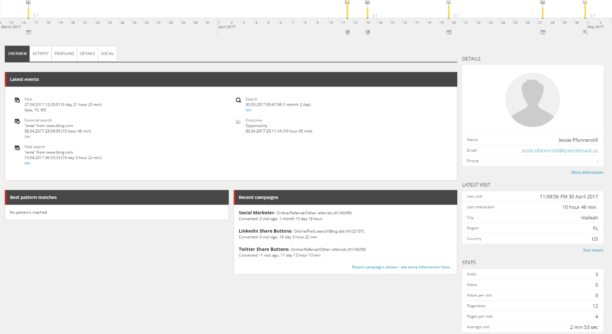

####################################
Path アナライザー
####################################

Path アナライザーを使用すると、コンタクトがウェブサイトをナビゲートする際の連続したパスを示すマップを作成することができます。キャンペーンとのやりとり中にコンタクトが取るパスや、目標や成果のトリガーとなるパスを見ることができます。

新しいPath アナライザー マップを作成して、コンタクトがキャンペーンやデジタル資産と対話する際のさまざまなタイプの体験を追跡することができます。また、新しいマップを作成して、初めての訪問者や再訪者の体験など、特定のタイプのウェブサイト訪問者の体験を分析することもできます。この情報から、さまざまな種類の訪問者がコンテンツとどのように相互作用しているかを知ることができます。

パス アナライザでは、どのパスが最もトラフィックが多く、どのパスが最も高いエンゲージメント価値を提供し、どのパスが訪問あたりのエンゲージメント価値または効率性を提供しているかがわかります。これにより、どのコンテンツがうまく機能しているのか、どのコンテンツが効率が悪く最適化できるのかについての洞察を得ることができます。

*******************
ページアナライザー
*******************

ページアナライザーを使用して、ウェブサイト上の特定のページへのパスとそこからのパスを表示することができます。(これは、ウェブサイト内で最も頻繁に移動するパスを大規模に表示する Path Analyzer とは対照的です)。ページアナライザーを開くには、ページのノードをクリックして、ページアナライザーで開くをクリックします。

.. image:: images/15eafd36352acf.png
   :align: center
   :width: 400px
   :alt: ページアナライザー

ページアナライザーでは、ページにつながるパスを探索し、この特定のパスの経験を持つ個々の連絡先を表示することができます。

.. image:: images/15eafd3635a078.png
   :align: center
   :width: 400px
   :alt: ページアナライザー

このように、パス・アナライザを使用すると、すべてのパスを表示する非常に高レベルのパス・マップ・ビューから、ページ固有の分析ビューへと進み、そのパスの経験を持つ個々の連絡先にたどり着き、彼または彼女の経験プロフィールを引き出すことができます。

******************************************
さまざまなコンタクトエクスペリエンスを分析
******************************************

Path アナライザーでは、コンタクトがウェブサイト上で経験したことをマッピングして表示することができます。コンタクトが特定の目標やページイベントをトリガーするまでにどのページを訪問したかを見ることができます。また、特定のチャンネルや特定のキャンペーンからのトラフィックを識別するマップを設定することもできます。Path アナライザーでは、どのパスが効率的にコンタクトを希望のビジネス成果に導くのか、どのパスが効果的でないのかを表示します。

また、コンタクトがウェブサイトで行うさまざまなタイプのインタラクションをマップすることもできます。たとえば、初めてウェブサイトを訪れた人の体験をマップし、その後、再び訪れた人の体験を示すマップを作成して、2 つの体験の違いを比較することができます。場所やデバイスなどに基づいたマップを作成することができます。接触体験を比較することで、異なるオーディエンスに対してコンテンツがどのように機能するかについての洞察を得ることができます。

マップを作成したら、[マップの概要] を使用して確認できます。

* パスに関する情報を提供する特定のレポート。たとえば、パスを訪問した連絡先の数、そのパスが生成したエンゲージメント値、パスが生成した訪問 1 回あたりの平均値などのレポートを見ることができます。

  * [メトリクス] タブでは、この特定のパスがどのように実行されているかについて、より詳細なメトリクスを確認できます。
  * 連絡先タブには、特定のパスを訪れた連絡先とそれにマッチするパターンカード、それらがトリガーとなったゴールと成果、そしてそれらがどこから来たかが表示されます。

* ファンネルは、外部チャネルからウェブサイトに来たコンタクトを追跡し、ゴールや成果に変換するまでの過程でコンテンツを通過したコンタクトを追跡するものです。

.. tip:: 英語版 https://doc.sitecore.com/users/93/sitecore-experience-platform/en/the-path-analyzer.html

.. toctree::
   :hidden:
   :maxdepth: 1

   path-analyzer-glossary
   path-analyzer-maps
   path-analyzer-funnels