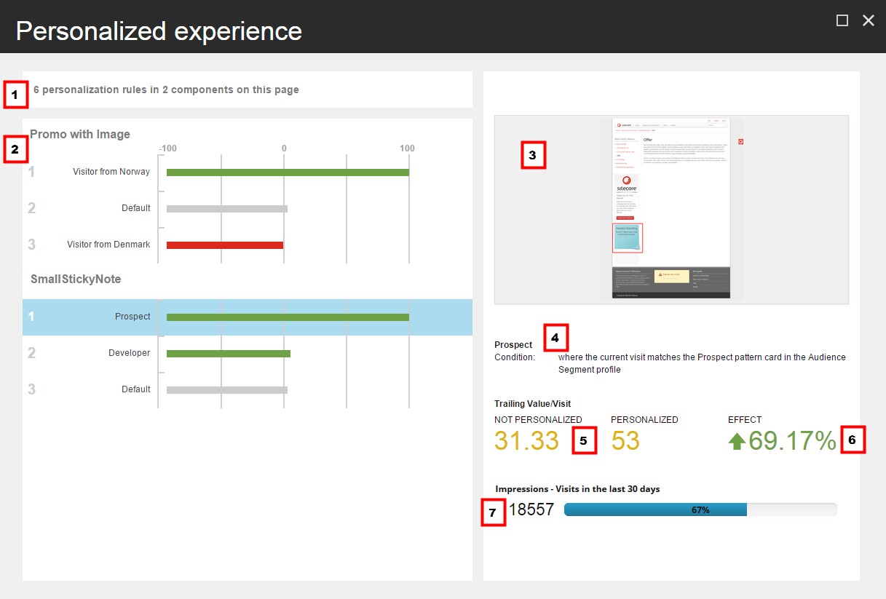
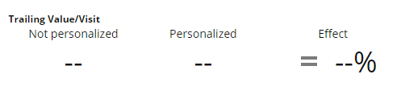

######################################################
パーソナライズされたエクスペリエンスダイアログボックス
######################################################

パーソナライズされたエクスペリエンス ダイアログ ボックスには、現在のページで実装されているパーソナライゼーション ルールの統計情報と、そのページでテスト中のパーソナライゼーション ルールの統計情報が表示されます。

ダイアログを開くには、エクスペリエンス エディタの「最適化」タブで「パーソナライズ」をクリックします。Sitecore は、ページにパーソナライズルールがある場合にのみ、パーソナライズボタンを有効にします。

パーソナライズされたエクスペリエンス] ダイアログ ボックスには、次のように表示されます。

.. note:: 以下の番号が付けられた説明は、前のスクリーンショットの吹き出しと関連しています。

1. ページ上のルールの要約 - ページ上のルールとコンポーネントの数の要約（例えば、このページの2つのコンポーネントに6つのパーソナライズルールがある場合）。
2. コンポーネントに対する各ルールの相対効果 - コンポーネントごとにグループ化されたすべてのルールのリスト（例えば、画像付きのプロモとSmallStickyNoteコンポーネント）。
   グラフは、各ルールの相対効果、または効果指数を示します。効果の説明はアイテム6を参照してください）。

    * デフォルトの条件にはインデックス0%が割り当てられています。
    * 最大の絶対的な末尾値/訪問を持つ条件には、その条件の末尾値がデフォルト条件の末尾値より大きいか小さいかに応じて、インデックスマイナス100%またはインデックス100%が割り当てられます。
    * その他の条件は、これらの値を基準にして表示されます。
    * 条件の末尾の値がデフォルトの条件よりも大きい場合は、バーが緑色になります。
    * 条件の末尾の値がデフォルトの条件よりも小さい場合は、バーが赤になります。

3. ページ プレビュー - 現在選択されているルールが有効なときのページのプレビューです。関連するコンポーネントが強調表示されます。他のコンポーネントはデフォルトのルールを使用します。
4. 名前と説明 - 現在選択されているルールの名前と説明です。
5. トレーリング値/訪問 - 現在選択されているルールのトレーリング値/訪問。これは、訪問者がテストされているページに遭遇した後に発生したページビューのみをカウントして、サイト訪問数で割った総トレーリングエンゲージメントバリューとして計算されます。
   ダイアログには、コンポーネントのパーソナライズされたバリエーションとパーソナライズされていないバリエーションの値が表示されます。パーソナライズされたフィールドには、コンポーネントのパーソナライズされたバージョンにアクセスした訪問者の末尾の値/訪問回数が含まれます。パーソナライズされていない] フィールドには、ルールの条件を満たしているが、既定のコンテンツにさらされている訪問者の値/訪問の末尾が表示されます。
   デフォルト条件の場合、パーソナライズされた末尾の値/訪問は存在しないため、効果はありません。対応するフィールドには値が含まれず、 - - が表示されます。

6. 効果 - パーソナライズされたエクスペリエンスの後続値/訪問（TVV）とデフォルトのエクスペリエンスとの間のパーセンテージの差。計算式は以下の通りです。
   効果 = ((パーソナライズされたTVV - パーソナライズされていないTVV) / パーソナライズされていないTVV) x 100

7. インプレッション - ページが表示され、現在選択されている条件が満たされた訪問数。バーには、この数字が示すページへの全訪問数の割合が表示されます。

.. note:: インプレッションには、条件を満たす訪問が含まれますが、デフォルトのエクスペリエンスが表示されます。

インプレッション数%の計算式は以下の通りです。

インプレッション数 % = (条件に合致してページを閲覧した訪問者/ページを閲覧したすべての訪問者) x 100

.. note:: 

    パーソナライゼーションルールがアクティブなテストにはないが、以前にテストされたことがある場合。

        * テスト後最初の 30 日間は、すべての主要パフォーマンス指標（KPI：追跡値/訪問、効果、および印象）は、テストからのデータに基づいています。
        * テスト後30日以上は、KPIは `パーソナライズ効果のトラッキング <personalization-effect-tracking>` からのデータに基づいています。(トラッキングが無効になっている場合、フィールドには-が表示されます)。

    ルールが一度もテストされていない場合、KPIはパーソナライゼーション効果のトラッキングデータに基づいています。

パーソナル化ルールがアクティブなテストに含まれていない場合は、ルールを選択して パーソナル化の編集 をクリックすると、ダイアログ ボックスから直接ルールを編集することができます。ルールがアクティブなテストに含まれている場合、このボタンは無効になります。

.. tip:: 英語版 https://doc.sitecore.com/users/93/sitecore-experience-platform/en/the-personalized-experience-dialog-box-410327.html