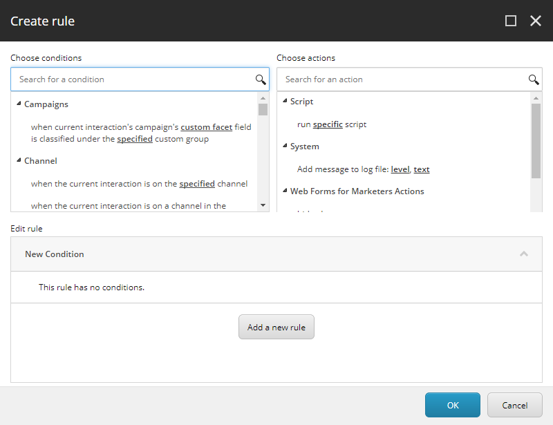
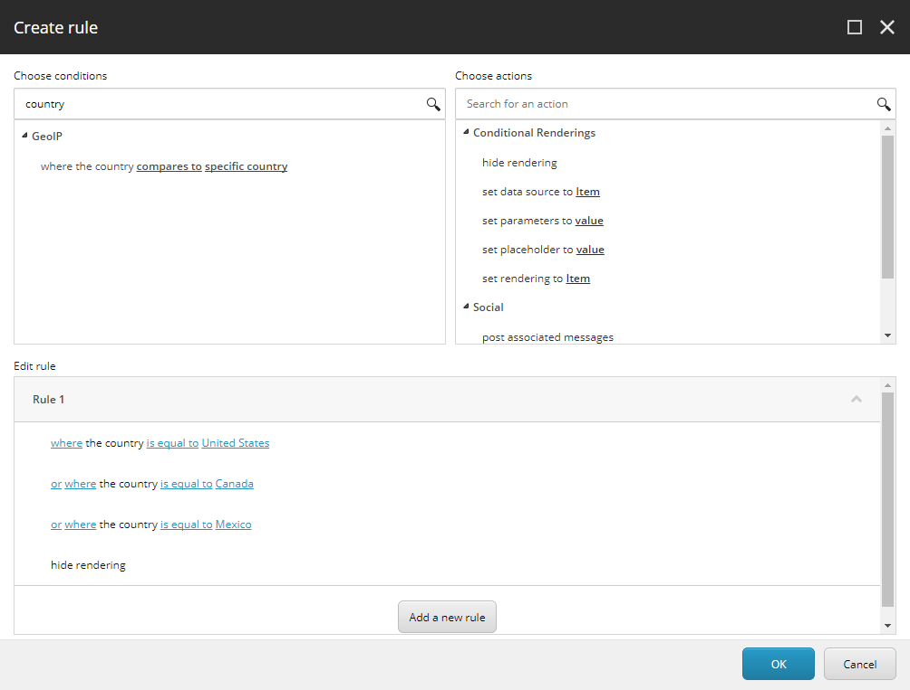

####################################
ルールセットエディタ
####################################

ルールセットエディタは、コンテンツ管理にロジックベースのルールを適用するツールです。ルールセットエディタを使用して条件付きレンダリングを作成し、コンタクトの体験をパーソナライズしてコントロールすることができます。

ルールセットエディタには、3つの基本的な要素があります。

* 条件
* アクション
* ルール

ルールセットエディタでは、条件とアクションを組み合わせて、パーソナライゼーションの実施、スクリプトの実行、エンゲージメントプランのステップの作成などに使用できるルールを作成します。

**********
条件
**********

条件は、条件が真かどうかを判断する論理的な文で構成されています。例えば、where an item is locked by me条件は、アイテムをロックした場合にtrueになります。

Sitecoreにはデフォルトの条件がいくつか用意されていますが、独自の条件を実装することもできます。

***************
アクション
***************

アクションは、ルール内の 1 つ以上の条件が真の場合に実装される論理的なステップです。たとえば、登録済みの連絡先に対して、登録フォームが以前に記入された場合に非表示にする条件を実装できます。

通常、条件の基準を満たす連絡先に対して Web サイトの条件付きレンダリングを実装するアクションを作成します。また、条件が満たされた場合にコンテンツを非表示にしたり、表示したりするアクションを指定することもできます。

Sitecoreにはデフォルトのアクションがいくつか用意されていますが、独自のアクションを実装することもできます。

***************
ルール
***************

ルールは、1 つまたは複数のアクションと 1 つまたは複数の条件を関連付けます。ルールを実装する前に、条件とアクションを定義する必要があります。また、And や OR などの論理演算子を使用して、複数の条件とアクションの組み合わせを作成することもできます。

例えば、北米からの連絡先から特定のコンテンツ項目を非表示にするルールを作成することができます。ルールの条件は連絡先の地理的位置をチェックし、連絡先が米国、カナダ、メキシコの場合、ウェブサイトの関連ページは表示されません。

.. tip:: 英語版 https://doc.sitecore.com/users/93/sitecore-experience-platform/en/the-rule-set-editor.html