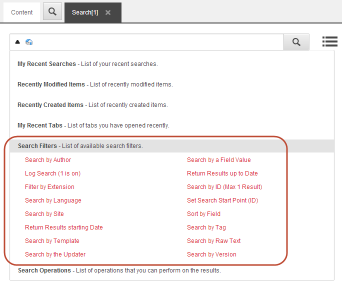

#####################
検索フィルター
#####################

Sitecoreで検索クエリを構築すると、Searchフィールドのドロップダウンメニューから以下の検索フィルタを選択することができます。

フィルタを選択すると、そのフィルタが検索フィールドに挿入され、検索結果はそれに応じてフィルタリングされます。

+------------------------+------------------------------------------------------------------------------------------------------------------------------------------------------------------------------------------------------------------------------------------------------+
| 検索フィルタ           | 概要                                                                                                                                                                                                                                                 |
+------------------------+------------------------------------------------------------------------------------------------------------------------------------------------------------------------------------------------------------------------------------------------------+
| 編集者で検索           | 特定の作者が作成したアイテムを検索します。                                                                                                                                                                                                           |
+------------------------+------------------------------------------------------------------------------------------------------------------------------------------------------------------------------------------------------------------------------------------------------+
| ログ検索 (1 is on)     | 単一の検索クエリのロギングをオンにします（1がオン、0がオフ）。                                                                                                                                                                                       |
+------------------------+------------------------------------------------------------------------------------------------------------------------------------------------------------------------------------------------------------------------------------------------------+
| 拡張子でフィルタリング | 特定の拡張子を持つアイテムを検索します。これは、メディアライブラリ内のファイルを検索する際に便利です。                                                                                                                                               |
+------------------------+------------------------------------------------------------------------------------------------------------------------------------------------------------------------------------------------------------------------------------------------------+
| 言語で検索             | 特定の言語での選択                                                                                                                                                                                                                                   |
+------------------------+------------------------------------------------------------------------------------------------------------------------------------------------------------------------------------------------------------------------------------------------------+
| サイトで検索           | 特定のサイトのアイテムを検索します。これは、同じSitecoreインストール上に複数のサイトがある場合に便利です。                                                                                                                                           |
+------------------------+------------------------------------------------------------------------------------------------------------------------------------------------------------------------------------------------------------------------------------------------------+
| 作成日で検索           | 特定の日付以降に作成されたアイテムを検索します。                                                                                                                                                                                                     |
+------------------------+------------------------------------------------------------------------------------------------------------------------------------------------------------------------------------------------------------------------------------------------------+
| テンプレートで検索     | 特定のテンプレートに基づいて項目を検索します。                                                                                                                                                                                                       |
+------------------------+------------------------------------------------------------------------------------------------------------------------------------------------------------------------------------------------------------------------------------------------------+
| バージョンで探す       | 特定のバージョン番号のアイテムを検索します。                                                                                                                                                                                                         |
+------------------------+------------------------------------------------------------------------------------------------------------------------------------------------------------------------------------------------------------------------------------------------------+
| フィールドの値で検索   | 特定のフィールドで特定の値を持つアイテムを検索します。例えば、「タイトル」フィールドに「デザイン」という単語を持つすべてのアイテムを検索するには、「custom:title|design」と入力します。                                                              |
+------------------------+------------------------------------------------------------------------------------------------------------------------------------------------------------------------------------------------------------------------------------------------------+
| 最新の結果を表示する   | 特定の日付またはそれ以前に作成されたアイテムを検索します。                                                                                                                                                                                           |
+------------------------+------------------------------------------------------------------------------------------------------------------------------------------------------------------------------------------------------------------------------------------------------+
| IDで検索 (最大1件)     | 特定のアイテムIDでアイテムを検索します。ID全体を入力する必要があります。                                                                                                                                                                             |
+------------------------+------------------------------------------------------------------------------------------------------------------------------------------------------------------------------------------------------------------------------------------------------+
| 検索開始点(ID)の設定   | 特定の場所からアイテムを検索します。検索を開始する場所に特定のコンテンツアイテムIDを入力します。                                                                                                                                                     |
+------------------------+------------------------------------------------------------------------------------------------------------------------------------------------------------------------------------------------------------------------------------------------------+
| フィールド別に並べ替え | コロンの後に指定されたフィールドのテキストに基づいて項目を並べ替えます。選択されたフィールドは、トークン化されていない (アナライザを持たない) か、または KeywordTokenizer のような単一のタームのみを生成するアナライザを使用している必要があります。 |
+------------------------+------------------------------------------------------------------------------------------------------------------------------------------------------------------------------------------------------------------------------------------------------+
| タグで検索             | 特定のタグが付いている項目を検索します。                                                                                                                                                                                                             |
+------------------------+------------------------------------------------------------------------------------------------------------------------------------------------------------------------------------------------------------------------------------------------------+
| テキストで検索         | 特定のがを含む単語を探します。                                                                                                                                                                                                                       |
+------------------------+------------------------------------------------------------------------------------------------------------------------------------------------------------------------------------------------------------------------------------------------------+

.. tip:: 英語版 https://doc.sitecore.com/users/93/sitecore-experience-platform/en/the-search-filters.html

