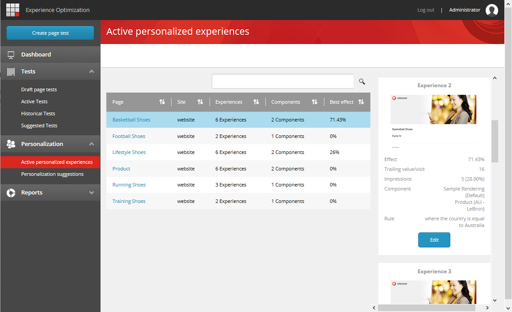

################################################################
アクティブなパーソナライズされたエクスペリエンスリストを使用する
################################################################

アクティブなパーソナライズされた体験のリストでは、あなたのウェブサイトで作成されたすべてのパーソナライズされた体験の概要を見ることができます。リストには、テスト済みで実装されたパーソナライズされた体験、テストなしで実装されたパーソナライズされた体験、および現在テスト中のパーソナライズされた体験が含まれています。

エクスペリエンス最適化のメニューパネルから、パーソナライズの下にある「アクティブなパーソナライズされた体験」のリストを開きます。

リストの各行は、パーソナライズされた 1 ページを表しています。リストをソートしてフィルタリングしたり、アイテム名や表示名でページを検索したりすることができます。

ページ上のコンポーネントにパーソナライゼーション ルールが適用されているコンポーネントの数と、異なるコンポーネントのバリエーションを組み合わせて作成できるエクスペリエンスの総数を確認できます。

最高の効果フィールドには、デフォルトの経験と比較した最高の経験の効果が表示されます。

*********************************
1ページのためにすべての体験を見る
*********************************

ページの詳細情報を表示するには、行内をクリックします。すると右側のスマートパネルが開き、そこにはページの経験ごとの経験カードが表示されます。

それぞれの体験について、以下のような情報を見ることができます。

* エクスペリエンスのイメージ
* デフォルトのエクスペリエンスと比較したエクスペリエンスの効果。効果は、パーソナライズされたエクスペリエンスの末尾の値/訪問とデフォルトのエクスペリエンスとの間のパーセントの差として計算されます

.. note::

    テストが30日以内に完了した場合、効果はテストのデータに基づいて計算されます。テストが30日以上前に完了した場合、効果はパーソナライゼーション効果のトラッキングからのデータに基づいて計算されます。

    最近のテストがなく、トラッキングが無効になっている場合は、フィールドは空です。

* トレイリング値/訪問。これは、後続のエンゲージメントの合計値（訪問者がテスト対象のページに遭遇した後に発生したページビューのみをカウント）を、エクスペリエンスに暴露された訪問数で割ったものです。
* 効果が計算される期間中のエクスペリエンスへの訪問数。
* ページ上のすべてのパーソナライズされたコンポーネントの名前。
* 体験に含まれるすべてのパーソナライズされたコンポーネントの組み合わせルール。

*******************************************
エクスペリエンスエディタでページを開く
*******************************************

リストからページに簡単にアクセスして、既存のパーソナライズされたエクスペリエンスを編集したり、新しいエクスペリエンスを作成したりすることができます。エクスペリエンスエディタでページを開くには

* アクティブなパーソナライズされた体験のリストで、ページ名をクリックします。
* または、スマートパネルで[編集]をクリックします。

.. tip:: 英語版 https://doc.sitecore.com/users/93/sitecore-experience-platform/en/using-the-active-personalized-experiences-list.html