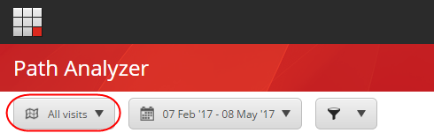
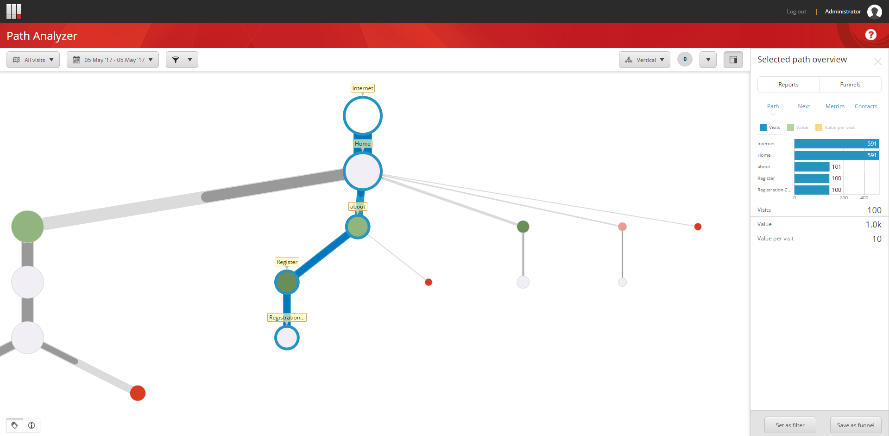
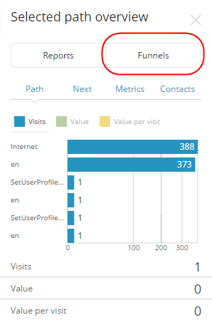
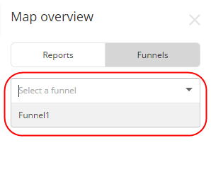
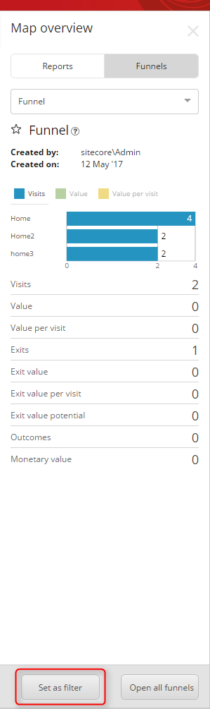
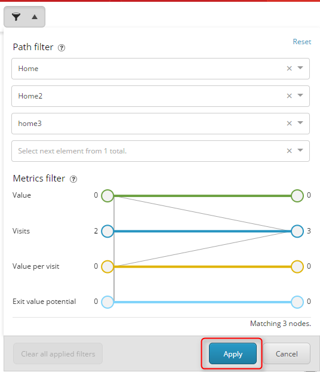

######################################################
Path ファネルを見る
######################################################

:doc:`Path Analyzerのファネル <path-analyzer-funnels>` とファネルレポートは、コンタクトがウェブサイトから離脱した際の貴重な情報を提供し、ウェブサイトの潜在的なコンバージョンの低下箇所やコンテンツ戦略の最適化に役立ちます。

パスファネルを表示するには

1. スタート画面から、Path Analyzerを開きます。
2. ドロップダウンメニューからサイトマップを選択します。

3. マップ上で、ファネルを表示するパスのエンドノードをクリックします。

4. 右側のペインで、[選択したパスの概要] ペインで [ファンネル] をクリックします。

5. マップ概要ペインで、[ファネルの選択] ドロップダウンリストをクリックし、関連するファネルを選択します。

6. フィルターを開き、ファネルの詳細を記入するには、Set as filterをクリックします。

7. 表示されるパス フィルタ ダイアログ ボックスで [適用] をクリックして、ファネルの詳細を含むマップをフィルタリングします。

これで、選択したファネルのレポートを見ることができます。

.. tip:: 英語版 https://doc.sitecore.com/users/93/sitecore-experience-platform/en/view-a-path-funnel.html
