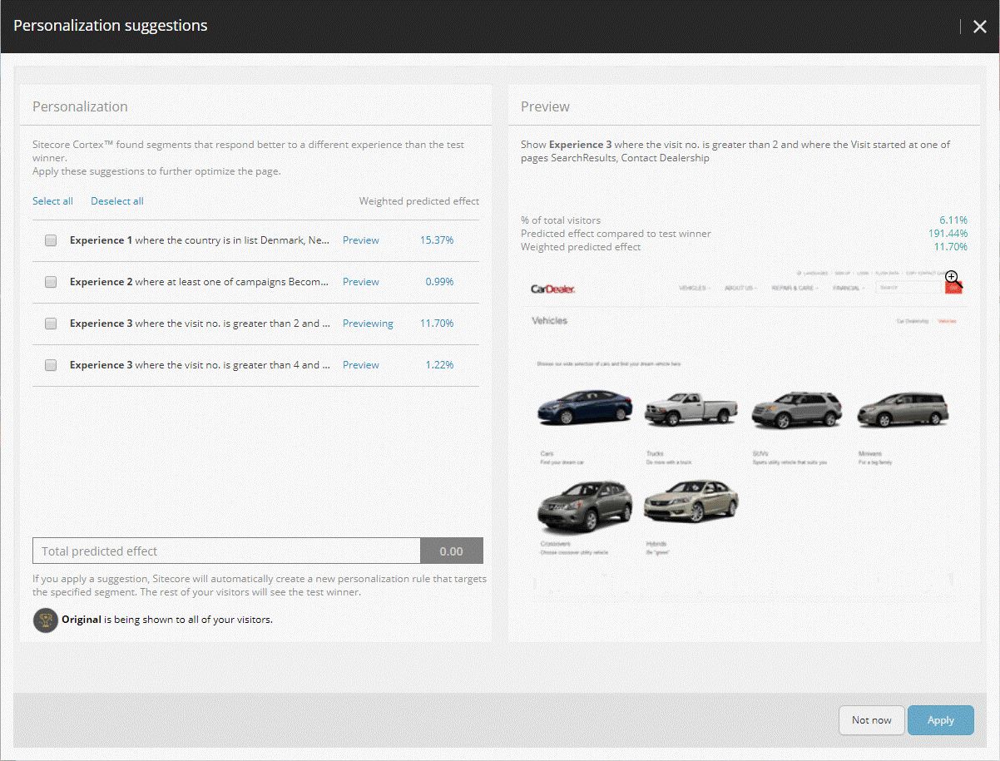

######################################################
ページのパーソナライズ提案の表示と適用
######################################################

エクスペリエンス エディタでページのパーソナライズの提案を表示するには、2 つの方法があります。

* テスト サマリー ウィンドウの [個人設定の提案] タブを開きます。
  コンポーネントテストが終了すると（Sitecore がテストの勝者を選択するのに十分なデータを収集したため、または手動で勝者を選択したため）、Sitecore は Test Summary ダイアログボックスを表示します。Sitecore CortexTM が、テストの勝者よりも別の体験に対してより良い反応を示すセグメントを見つけた場合、Test Summary ウィンドウには、Personalization suggestions タブが表示されます。

* 最適化リボンから個人設定の提案ダイアログボックスを開きます。

  テストの概要 ダイアログ ボックスから提案を適用しない場合でも、提案は利用可能です。エクスペリエンス エディタでは、現在のページの完了したコンポーネント テストから適用されていないすべての提案を表示できます。個人設定の提案 ウィンドウを開くには、最適化リボンの リスト グループで 個人設定の提案 をクリックします。

また、エクスペリエンス最適化アプリケーションでは、:doc:`すべてのサイトとページのパーソナライゼーション提案の概要 <get-an-overview-of-personalization-suggestions-for-all-pages>` を確認することができます。

*******************************************
パーソナライゼーションの提案を適用する
*******************************************

テスト サマリー ダイアログ ボックスの パーソナル化の提案 タブと パーソナル化の提案 ダイアログ ボックスの外観と動作は同じです。

テスト サマリー ダイアログ ボックスの パーソナル化の提案 タブは、次のように表示されます。

.. image:: images/15ed64a25b8890.png
    :align: center
    :width: 400px
    :alt: パーソナライゼーションの提案を適用する

個人設定の提案ダイアログボックスは、エクスペリエンス エディタのエクスペリエンス最適化リボンまたはエクスペリエンス最適化アプリケーションの個人設定の提案リストから開くことができ、次のように表示されます。

左側のペインには、テストの勝者とは異なる経験に対してより良い反応を示すセグメントのリストが表示されます。各行の重み付き予測効果は、提案されたセグメントの勝利体験と比較した好ましい体験の効果を示し、選択されたセグメントの相対的な大きさを考慮に入れています。ウィンドウの下部にある合計予測効果は、選択されたすべての提案の予測された複合効果を示します。

右側のペインには、リスト内のセグメントが好む体験のプレビューが表示されます。

パーソナライズ提案を適用するには

1. 適用する各提案のチェックボックスを選択します。

    .. note:: セグメントが表示される体験をプレビューするには、そのセグメントの行で [プレビュー] をクリックします。

2. 適用 をクリックします。
   選択したパーソナライゼーション ルールで現在のページの新しいバージョンが作成されます。

3. ページをワークフローにプッシュし、ページを公開します。

パーソナライズ提案を適用した場合、セグメントのいずれにも一致しない訪問者に対しては、テストの勝者はデフォルトのエクスペリエンスのままで、適用された各提案に対して最高の結果を得たエクスペリエンスが定義されたセグメントに表示されます。

.. tip:: 英語版 https://doc.sitecore.com/users/93/sitecore-experience-platform/en/view-and-apply-personalization-suggestions-for-a-page.html
