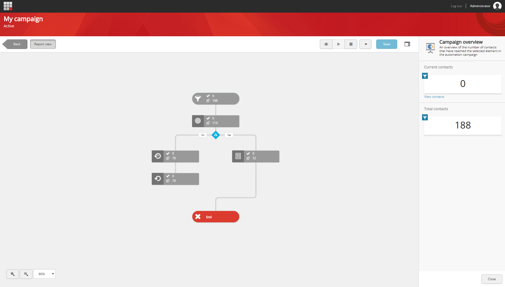
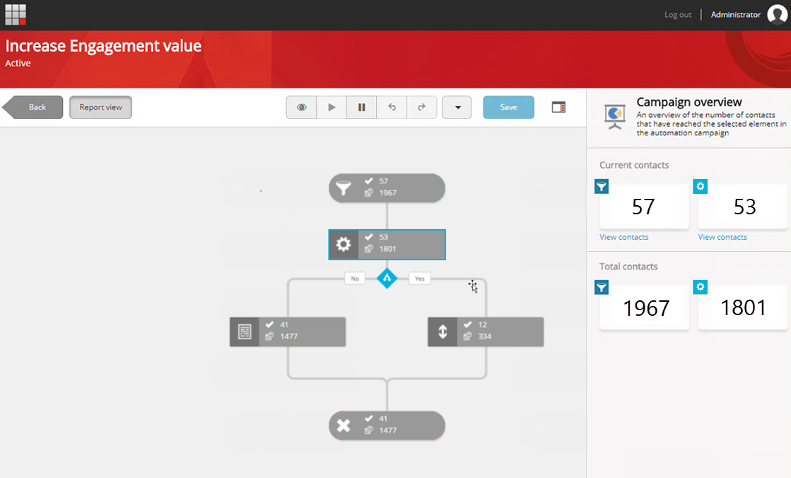
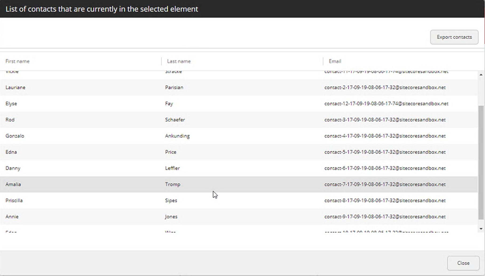

################################################
オートメーションキャンペーンのレポートを表示
################################################

オートメーションキャンペーンと対話しているコンタクトの数の概要を知るには、レポートビューでキャンペーンを表示することができます。レポートビューでは、各要素の外観が変化し、オートメーションキャンペーンのその状態にある連絡先の数を表示します。

.. note:: キャンペーンで利用可能なレポート情報がない場合（キャンペーンに登録されている連絡先がない場合など）、レポートビューにアクセスすることはできません。

オートメーションキャンペーンのレポートを表示するには

1. マーケティングオートメーションのダッシュボードで、関連するオートメーションキャンペーンに移動して開きます。
2. レポートビューをクリックして、キャンペーンのさまざまな段階での現在の連絡先と合計連絡先の数を表示します。

.. note:: 連絡先がまだ到達していないキャンバス上の要素は、レポートビューでは変更されません。

3. 特定の要素の連絡先に関する詳細情報を見るには、キャンバス上の関連する要素をクリックします。これにより、右側にキャンペーン概要ペインが開きます。

   現在の連絡先セクションが表示されます。

    * [現在の連絡先]セクションには、次のものが表示されます。
    * 現在、オートメーションキャンペーンの選択した要素にある連絡先の数。コンタクトはこれらの要素を非常に素早く通過するため、マーケティングアクション要素の場合、この数は常に0です。

   連絡先の合計数のセクションに表示されます。

    * このオートメーションキャンペーンに登録されている連絡先の総数。
    * オートメーションキャンペーンの選択された要素に到達した連絡先の総数。

4. 現在キャンペーンに登録されている、または選択した要素によって評価されている連絡先のリストを表示またはエクスポートするには、関連するセクションの下のキャンペーン概要ペインで、[連絡先の表示]をクリックします。

5. 連絡先のリストを.csvファイルにエクスポートするには、[連絡先のエクスポート]をクリックします。

.. note:: レポートビューでは、連絡先はアクティブなキャンペーン中に移動し続けるため、一度に要素内の連絡先の数が変更されることがあります。したがって、連絡先をエクスポートするときは、その時点で要素にある連絡先をエクスポートします。

6. オートメーションキャンペーン全体のレポートビューを閉じるには、再度レポートビューをクリックします。

.. tip:: https://doc.sitecore.com/users/93/sitecore-experience-platform/en/view-reports-for-an-automation-campaign.html

